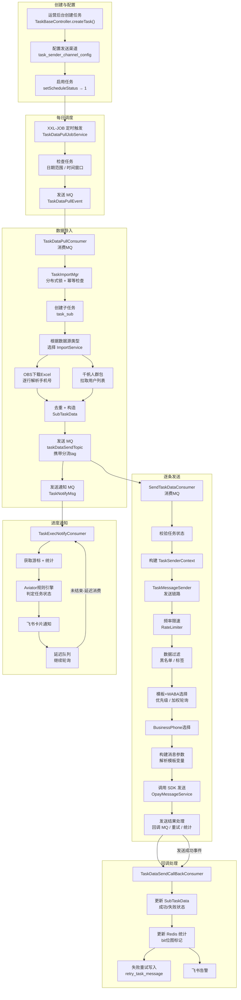
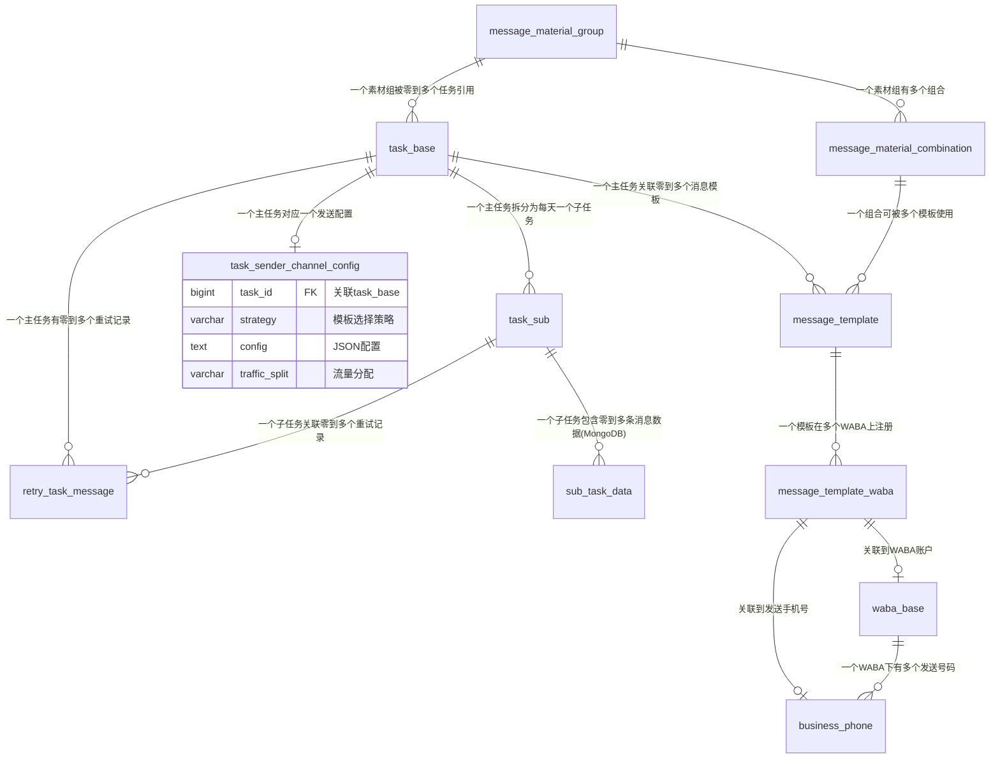

# 群发任务流程及数据结构

## 一、整体流程全景图



## 二、各阶段详细说明

### 2.1 创建与配置

**Controller**: `TaskBaseController.createTask()`
**Service**: `TaskBaseServiceImpl.createTask()`

运营人员在后台填写任务信息：

- **基本信息**: 任务名称、业务类型（MARKETING / AUTHENTICATION / UTILITY / MARKETING_MMLITE）
- **日期范围**: `startDate` ~ `endDate`，每日发送时间窗口 `pushStartTime`
- **数据来源**: `dataSource`（WEB_IMPORT / QIANFAN_INNER_WHITE / QIANFAN_OUT_WHITE 等）+ `dataSourceMeta`（OBS路径/千帆批次ID）
- **发送策略**: 关联 `task_sender_channel_config` 配置模板选择策略、流量分配、物料组等
- **屏蔽规则**: 特殊日期/星期几不发送
- **标签过滤**: `tagFilterExpression` 实时过滤目标用户
- **备份策略**: `backupDsStrategyType` + `backupDsRange`，主数据源失败后自动切备份

创建后 `scheduleStatus` 默认为 0（禁用），需运营手动启用。

### 2.2 每日调度

**入口**: `TaskDataPullJobService.taskDataPullJob()`（XXL-JOB 每日定时执行）

1. 查当天所有 `scheduleStatus=1` 且在日期范围内的主任务
2. 仅处理 `FILE_IMPORT_SOUCE_SET` 类型的数据源（文件导入类）
3. 检查当前时间是否在 `pushStartTime` 窗口内
4. 发送 `TaskDataPullEvent` 到 RocketMQ

### 2.3 数据导入

**MQ 消费者**: `TaskDataPullConsumer` → `TaskImportMgr`

关键步骤：

1. **幂等检查**: 若今天已创建子任务且主任务未变更（对比 `task_utime`），跳过
2. **分布式锁**: Redisson 锁（key = taskId），防止重复执行
3. **创建子任务**: `taskSubService.createTaskSub()` 生成 `task_sub` 记录，初始化游标
4. **数据导入（按数据源类型）**:

| 数据源类型 | 实现类 | 说明 |
|-----------|--------|------|
| `WEB_IMPORT` | `WebImportDataImportService` | 从 OBS 下载 Excel，逐行解析手机号 |
| `QIANFAN_INNER_WHITE` | `QianFanInnerWhiteDataImportService` | 千帆内部白名单 |
| `QIANFAN_OUT_WHITE` | `QianFanOuterWhiteDataImportService` | 千帆外部白名单 |

5. **去重**: 通过 Redis SETNX 或内存 Set 去重，可配置 Redis Key TTL
6. **入库**: 构造 `SubTaskData`（MongoDB），发送到 `taskDataSendTopic`（RocketMQ），按渠道添加不同 tag 进行流量分流
7. **发送通知**: `TaskNotifyMsg` → 通知 Topic，触发飞书卡片

### 2.4 逐条发送

**MQ 消费者**: `SendTaskDataDefaultConsumer` / `SendTaskDataCustomNewTagConsumer`
**核心执行器**: `SendTaskDataConsumeWorker` → `TaskMessageSenderAdapter`
**实际发送**: `TaskMessageSenderImpl.sendTaskTemplateMessage()`

发送链路（按顺序）：

```
校验任务状态 → 频率限速(RateLimiter) → 数据过滤(黑名单/标签)
→ 模板+WABA选择(优先级/加权轮询) → BusinessPhone选择(权重)
→ 构建消息参数(模板变量解析) → 调用 SDK 发送(OpayMessageService)
→ 发送结果处理(回调MQ/重试/统计更新)
```

**关键组件**:

| 组件 | 说明 |
|------|------|
| `RateLimiter` | 按 businessPhone 或 taskId 维度限速，支持动态调整速率 |
| `BlackListChecker` | 判断手机号/用户是否在黑名单 |
| `TaskTagFilterChecker` | 基于 Aviator 标签表达式过滤 |
| `TemplateAndWabaSelector` | `PriorityTemplateAndWabaSelectorImpl`（优先级）/ `WeightedRoundRobinTemplateAndWabaSelectorImpl`（加权轮询） |
| `TaskWeightBusinessSelectorImpl` | 根据 businessPhone 的各业务类型权重进行选择 |
| `MessageParamsHandlerManager` | 解析模板参数：`LocalTableParamsHandler`（本地表）、`CommonServerParamsHandler`（通用服务）、`IdnServerParamsHandler`、`BusinessIdnParamsHandler` 等 |
| `OpayMessageService` | 适配不同 Agent 类型（ADA / NXCloud / YCloud / Vonage / GPI）统一发送 |
| `FrequencyLimitCheckerFilter` | 频控检查，匹配的规则记录到上下文中 |
| `FrequencyLimitRefunder` | 频控退款，限流失败的计数返还 |

**失败重试机制**: `TaskMessageRetry`，支持主数据源失败后切备份数据源（`PRIMARY` → `BACKUP` 阶段），错误码分级决定是否重试。

### 2.5 回调处理

**MQ 消费者**: `TaskDataSendCallBackConsumer`

1. 接收 `TaskDataCallBackEvent`，按状态（SENT / DELIVERED / READ / FAILED）分流
2. 从 `OpayMessage` 中解析三方回调状态，更新 `SubTaskData`
3. 更新 Redis 子任务统计（位图标记，`SubTaskCountRedisKeyEnum`）
4. 失败消息写入 `retry_task_message` 表，等待重试 Job 消费
5. 飞书告警（异常情况）

### 2.6 进度通知与看板

**MQ 消费者**: `TaskExecNotifyConsumer`

- 通过延迟队列周期性触发的 `TaskNotifyMsg`
- 获取当前游标（已处理数量）和统计数据
- Aviator 规则引擎判断状态：`begin` / `sending` / `success` / `failed`
- 飞书卡片通知到运营群
- 未结束则继续发延迟消息轮询

**Web 管理后台**:
- `TaskBaseController.subTaskPageList()` — 子任务列表
- `queryTaskById()` — 任务详情
- 运营可在页面实时查看进度

## 三、数据结构详述

### 3.1 MySQL 表

#### `task_base` — 主任务表

```sql
CREATE TABLE `task_base` (
    `id`                bigint(20)   NOT NULL AUTO_INCREMENT COMMENT '主键',
    `name`              varchar(200) NOT NULL DEFAULT ''  COMMENT '任务名称',
    `business_type`     varchar(50)  NOT NULL DEFAULT ''  COMMENT '业务类型: AUTHENTICATION/MARKETING/UTILITY/MARKETING_MMLITE',
    `schedule_status`   int(11)      NOT NULL DEFAULT '0' COMMENT '调度状态: 0=禁用, 1=启用',
    `data_source`       varchar(100) NOT NULL DEFAULT ''  COMMENT '数据来源: WEB_IMPORT/QIANFAN_INNER_WHITE/QIANFAN_OUT_WHITE',
    `data_source_meta`  varchar(500) NOT NULL DEFAULT ''  COMMENT '数据源元信息(OBS路径/千帆批次ID)',
    `start_date`        varchar(20)  DEFAULT NULL COMMENT '开始日期 yyyy-MM-dd',
    `end_date`          varchar(20)  DEFAULT NULL COMMENT '结束日期 yyyy-MM-dd',
    `push_start_time`   varchar(20)  DEFAULT NULL COMMENT '每日发送时间窗口',
    `shield_rule`       text         COMMENT '特殊日期屏蔽规则',
    `tag_filter_expression` text     COMMENT '实时标签过滤表达式',
    `lane_code`         varchar(100) DEFAULT NULL COMMENT '渠道配置',
    `message_template_id` bigint(20) DEFAULT NULL COMMENT '消息模板ID(v1版本)',
    `template_waba_weight` text      COMMENT '模板+WABA权重JSON',
    `ds_strategy_type`  varchar(100) DEFAULT NULL COMMENT '主数据源策略类型',
    `ds_range`          varchar(200) DEFAULT NULL COMMENT '主数据源范围',
    `ds_header_degradation` varchar(200) DEFAULT NULL COMMENT '主header降级策略',
    `backup_ds_strategy_type` varchar(100) DEFAULT NULL COMMENT '备份数据源策略类型',
    `backup_ds_range`   varchar(200) DEFAULT NULL COMMENT '备份数据源范围',
    `backup_ds_header_degradation` varchar(200) DEFAULT NULL COMMENT '备份header降级策略',
    `creator`           varchar(100) DEFAULT NULL,
    `updater`           varchar(100) DEFAULT NULL,
    `ctime`             bigint(20)   DEFAULT NULL,
    `utime`             bigint(20)   DEFAULT NULL,
    PRIMARY KEY (`id`)
) ENGINE=InnoDB DEFAULT CHARSET=utf8mb4 COMMENT='主任务表';
```

#### `task_sub` — 子任务表（每日一条）

```sql
CREATE TABLE `task_sub` (
    `id`             bigint(20)  NOT NULL AUTO_INCREMENT COMMENT '主键',
    `task_id`        bigint(20)  NOT NULL COMMENT '关联 task_base.id',
    `task_date`      varchar(20) DEFAULT NULL COMMENT '执行日期 yyyy-MM-dd',
    `task_utime`     bigint(20)  DEFAULT NULL COMMENT '执行时主任务utime(幂等用)',
    `status`         int(11)     DEFAULT '0' COMMENT '状态: 0=停止, 1=启用',
    `task_info_json` text        COMMENT '统计信息JSON',
    `ctime`          bigint(20)  DEFAULT NULL,
    `utime`          bigint(20)  DEFAULT NULL,
    PRIMARY KEY (`id`),
    KEY `idx_task_id` (`task_id`, `task_date`)
) ENGINE=InnoDB DEFAULT CHARSET=utf8mb4 COMMENT='子任务表(按天拆分)';
```

#### `task_sender_channel_config` — 发送渠道配置表

```sql
CREATE TABLE `task_sender_channel_config` (
    `id`                       bigint(20) unsigned NOT NULL AUTO_INCREMENT COMMENT '主键',
    `task_id`                  bigint(20) unsigned DEFAULT '0' COMMENT '关联 task_base.id',
    `strategy`                 varchar(200) NOT NULL DEFAULT '' COMMENT '策略: PRIORITY/WEIGHTED_ROUND_ROBIN/AUTOMATIC_MATERIAL',
    `config`                   text COMMENT 'JSON配置(见下方说明)',
    `traffic_split`            varchar(100) DEFAULT NULL COMMENT '素材组合流量分配',
    `custom_combination_weight` text COMMENT '自定义组合权重JSON',
    `deduplication_period`     int(11) DEFAULT NULL COMMENT '去重周期(天)',
    `chat_robot`               varchar(100) DEFAULT NULL,
    `end_chat_jump_link`       varchar(500) DEFAULT NULL,
    `ctime`                    bigint(20) DEFAULT NULL,
    `utime`                    bigint(20) DEFAULT NULL,
    PRIMARY KEY (`id`),
    UNIQUE KEY `idx_task_id` (`task_id`)
) ENGINE=InnoDB DEFAULT CHARSET=utf8mb4 COMMENT='发送渠道配置';
```

`config` JSON 结构：

```json
{
  "circleNum": 3,
  "groupTemplateList": [
    {"agentTemplateId": "1438080404170050", "priority": 3, "weight": 3}
  ],
  "templateIdList": ["123", "456"],
  "materialGroupId": 1,
  "backupMaterialConfig": {
    "materialGroupId": 2,
    "trafficSplit": "CUSTOM_WEIGHT",
    "customCombinationWeight": [{"i": 1, "w": 50}, {"i": 2, "w": 50}],
    "deduplicationPeriod": 7
  }
}
```

#### `message_template` — 消息模板表

```sql
CREATE TABLE `message_template` (
    `id`                    bigint(20) NOT NULL AUTO_INCREMENT,
    `name`                  varchar(200) DEFAULT NULL COMMENT '模板名称',
    `status`                varchar(50)  DEFAULT NULL COMMENT '模板状态',
    `template_type`         varchar(50)  DEFAULT NULL COMMENT '类型: MARKETING/AUTHENTICATION/UTILITY',
    `language`              varchar(50)  DEFAULT NULL,
    `components`            text COMMENT '模板结构JSON(List<OpayTemplateComponent>)',
    `material_group_id`     bigint(20) DEFAULT NULL,
    `material_combination_id` bigint(20) DEFAULT NULL,
    `shadow_status`         varchar(50)  DEFAULT NULL COMMENT '影子模板状态',
    `creator`/`updater`/`ctime`/`utime`,
    PRIMARY KEY (`id`)
) ENGINE=InnoDB DEFAULT CHARSET=utf8mb4 COMMENT='消息模板';
```

#### `message_template_waba` — 模板与 WABA 关系表

```sql
CREATE TABLE `message_template_waba` (
    `id`                   bigint(20) NOT NULL AUTO_INCREMENT,
    `message_template_id`  varchar(100) DEFAULT NULL COMMENT '本地模板ID',
    `agent_template_id`    varchar(200) DEFAULT NULL COMMENT '三方消息模板ID',
    `business_phone`       varchar(50)  DEFAULT NULL COMMENT '发送手机号',
    `agent`                varchar(50)  DEFAULT NULL COMMENT '渠道: NXCLOUD/ADA/YCLOUD/VONAGE/GPI',
    `agent_name`           varchar(200) DEFAULT NULL,
    `waba_id`              varchar(100) DEFAULT NULL COMMENT 'WABA ID',
    `status`               varchar(50)  DEFAULT NULL COMMENT '模板审批状态',
    `category`             varchar(50)  DEFAULT NULL,
    `quality`              varchar(50)  DEFAULT NULL COMMENT '模板质量',
    `header_media_id`      varchar(500) DEFAULT NULL COMMENT '上传的header媒体ID',
    `header_media_upload_time` bigint(20) DEFAULT NULL,
    PRIMARY KEY (`id`),
    KEY `idx_waba` (`waba_id`, `agent_template_id`)
) ENGINE=InnoDB DEFAULT CHARSET=utf8mb4 COMMENT='模板与WABA关系';
```

#### `waba_base` — WABA 账户基础表

```sql
CREATE TABLE `waba_base` (
    `id`              bigint(20) NOT NULL AUTO_INCREMENT,
    `agent`           varchar(50)  DEFAULT NULL COMMENT '渠道: NXCLOUD/ADA',
    `agent_name`      varchar(200) DEFAULT NULL COMMENT '三方账户名',
    `waba_id`         varchar(100) DEFAULT NULL COMMENT 'WABA ID',
    `status`          varchar(50)  DEFAULT NULL COMMENT '账户状态',
    `meta_status`     varchar(50)  DEFAULT NULL COMMENT '风控状态',
    `ds_support_status`/`ds_risk_status`/`ds_risk_cnt`,
    PRIMARY KEY (`id`)
) ENGINE=InnoDB DEFAULT CHARSET=utf8mb4 COMMENT='WABA账户基础信息';
```

#### `business_phone` — 发送手机号表

```sql
CREATE TABLE `business_phone` (
    `id`                    bigint(20) NOT NULL AUTO_INCREMENT,
    `business_phone`        varchar(50)  DEFAULT NULL COMMENT '发送手机号',
    `agent`/`agent_name`/`waba_id`      COMMENT '渠道信息',
    `otp_weight`            int(11) DEFAULT '0' COMMENT 'OTP权重',
    `marketing_weight`      int(11) DEFAULT '0' COMMENT '营销权重',
    `marketing_mmlite_weight` int(11) DEFAULT '0',
    `notify_weight`         int(11) DEFAULT '0' COMMENT '通知权重',
    `support_task_types`    varchar(200) DEFAULT NULL COMMENT '支持的任务类型',
    `enable_status`         int(11) DEFAULT '0' COMMENT '启用状态: 0=禁用, 1=启用',
    `status`                varchar(50)  DEFAULT NULL COMMENT '质量状态',
    `messaging_limit`       varchar(50)  DEFAULT NULL,
    `throughput`            varchar(50)  DEFAULT NULL,
    PRIMARY KEY (`id`)
) ENGINE=InnoDB DEFAULT CHARSET=utf8mb4 COMMENT='发送手机号';
```

#### `retry_task_message` — 消息重试表

```sql
CREATE TABLE `retry_task_message` (
    `id`                       bigint(20) NOT NULL AUTO_INCREMENT,
    `task_id`                  bigint(20) DEFAULT NULL,
    `task_sub_id`              bigint(20) DEFAULT NULL,
    `receive_phone`            varchar(50)  DEFAULT NULL COMMENT '接收方手机号',
    `run_status`               tinyint(1) DEFAULT '0' COMMENT '运行状态',
    `run_status_expire_time`   bigint(20) DEFAULT NULL,
    `retry_count`              int(11) DEFAULT '0' COMMENT '已重试次数',
    `last_error_code`          int(11) DEFAULT NULL COMMENT '最后错误码',
    `last_fail_scene`          varchar(100) DEFAULT NULL COMMENT '最后失败场景',
    `is_sent`                  tinyint(1) DEFAULT '0' COMMENT '是否已成功发送',
    `is_closed`                tinyint(1) DEFAULT '0' COMMENT '是否关闭',
    `template_variable_json_str` text COMMENT '模板变量JSON',
    `retry_stage`              varchar(50) DEFAULT NULL COMMENT '重试阶段: PRIMARY/BACKUP',
    `create_time`/`update_time` bigint(20),
    PRIMARY KEY (`id`),
    KEY `idx_task` (`task_id`, `run_status`)
) ENGINE=InnoDB DEFAULT CHARSET=utf8mb4 COMMENT='消息重试';
```

#### 素材表

| 表名 | 说明 |
|------|------|
| `message_material_group` | 素材组，包括名称、模板类型、语言、组合模式(RANDOM/MANUAL) |
| `message_material_combination` | 素材组合实例，组装具体的 header/body/footer/buttons 物料 |
| `message_material_template` | 物料与模板关联(type: HEADER/BODY/FOOTER/BUTTONS) |

#### 统计表

| 表名 | 关键字段 | 说明 |
|------|---------|------|
| `task_message_statistic` | task_id, send_count, delivered_count, failed_count | 任务级消息统计 |
| `task_metric_score` | task_id, template_id, score_date, metric_score | 任务指标评分 |
| `task_metric_score_config` | - | 评分配置 |
| `task_metric_alert` | - | 指标告警配置 |
| `marketing_message_statistic` / `marketing_lane_message_statistic` | - | 营销消息/渠道统计 |
| `task_lane_template_message_statistic` | task_id, lane, template_id, 各状态计数 | 渠道模板粒度统计 |
| `task_lane_material_message_statistic` | task_id, lane, material_combination_id, 各状态计数 | 渠道素材粒度统计 |

### 3.2 MongoDB 集合

#### `sub_task_data` — 消息粒度数据

| 字段 | 类型 | 说明 |
|------|------|------|
| `_id` | ObjectId | 主键，同时也作为 `subTaskDataId` |
| `taskId` | Long | 主任务ID |
| `subTaskId` | Long | 子任务ID |
| `originPhoneNumber` | String | 原始手机号 |
| `standBusinessPhoneNumber` | String | 标准化手机号（如印尼 08xxxx 格式） |
| `sendUserId` | String | 发送用户ID（关联 MariaDB） |
| `bizInfo` | Map | 业务扩展信息，含模板变量 `TEMPLATE_VARIABLE_MAP` |
| `needRetry` | boolean | 是否允许重试 |
| `retryWhenCallbackFailed` | boolean | 回调失败时是否继续重试 |
| `sendCount` | Integer | 已发送次数 |
| `failedReason` | String | 失败原因描述 |
| `failedReasonCode` | Integer | 失败错误码 |
| `taskDataImportTime` | Instant | 数据导入时间 |
| `ctime` / `utime` | Instant | 创建/更新时间 |

### 3.3 Redis 数据结构

| Key 模式 | Value | 说明 |
|----------|-------|------|
| `whatsapp:crm:task:data:{taskId}:{phone}` | String(时间戳) | 数据导入去重，TTL 可配置 |
| `TASK:{taskId}:{subTaskId}` | Bitmap | 子任务各状态统计位图 |
| `SENDER:{agent}:{agentName}:{wabaId}:{bp}:{taskId}:{subTaskId}` | Bitmap | 发送方粒度统计位图 |
| `tasksub:taskStatJson:{subTaskId}` | String(JSON) | 子任务统计快照 |
| `whatsapp:crm:task:template:params:{taskId}` | String(JSON Set) | 任务模板参数集合缓存，TTL=5min |

`SubTaskCountRedisKeyEnum` 位图索引定义：

| 枚举值 | bit | 说明 |
|--------|-----|------|
| `IMPORT_COUNT` | 0 | 导入计数 |
| `IMPORT_REPEATED` | 1 | 导入重复 |
| `REQUEST_SUCCESS` | 2 | 请求发送成功 |
| `REQUEST_FAIL` | 3 | 请求发送失败 |
| `SENT` | 4 | 已发送到 WhatsApp |
| `DELIVERED` | 5 | 已送达 |
| `READ` | 6 | 已读 |
| `FAILED` | 7 | 回调失败 |

### 3.4 RocketMQ 消息流

| Topic | 消息体 | 生产者 → 消费者 | 说明 |
|-------|--------|----------------|------|
| `taskDataPullConsumerTopic` | `TaskDataPullEvent(taskId)` | `TaskDataPullJobService` → `TaskDataPullConsumer` | 每日触发数据导入 |
| `taskDataSendConsumerTopic` | `SubTaskData` | `TaskDataSave2Mq.addTaskData()` → `SendTaskDataDefaultConsumer` / `SendTaskDataCustomNewTagConsumer` | 按渠道tag分流发送 |
| `taskDataSendCallbackTopic` | `TaskDataCallBackEvent` | 发送完成后 → `TaskDataSendCallBackConsumer` | 回调状态处理 |
| `messageNotifyTaskSendTopic` | `TaskNotifyMsg` | `TaskImportMgr` / 延迟队列自身 → `TaskExecNotifyConsumer` | 飞书进度通知 |

支持的分流 tag（`SourceLaneEnum`）：

| Tag | 说明 |
|-----|------|
| `TASK_DATA_SEND_CONSUMER_WA_DEFAULT_TAG` | WA 默认渠道 |
| `TASK_DATA_SEND_CONSUMER_MARKETING_DEFAULT_TAG` | 营销默认渠道 |
| `TASK_DATA_SEND_CONSUMER_UTILITY_TAG` | 工具类消息渠道 |
| `TASK_DATA_SEND_CONSUMER_CUSTOMER_OLD_TAG` | 老客渠道 |
| `TASK_DATA_SEND_CONSUMER_CUSTOMER_NEW_TAG` | 新客渠道（按 `taskId%10` 或 `phone.hash%10` 进一步分片）|
| `TASK_DATA_SEND_CONSUMER_COLLECTION_MESSAGE_TAG` | 互动消息渠道 |

## 四、核心 ER 关系



## 五、关键设计要点

### 5.1 幂等与去重

- **任务级幂等**: `task_sub` 记录 `task_utime`，主任务未变更则今天不重复导入
- **数据级去重**: Redis SETNX + 可配置 TTL，或内存 Set 去重。支持 3 种模式（0=跳过 / -1=内存 / >0=Redis+TTL）
- **发送去重**: `deduplicationPeriod` 配置去重周期（仅 `AUTOMATIC_MATERIAL` 策略），避免同用户频繁收到相同素材

### 5.2 限流体系

| 层级 | 粒度 | 实现 | 说明 |
|------|------|------|------|
| 数据导入 | taskId | `RateLimiter` | 限制导入到 MQ 的速率 |
| MQ 消费 | 全局 | `RateLimiter` | 限制消费者处理速率 |
| 发送限速 | businessPhone | `RateLimiter` | 每个发送号码有独立限速器，支持按 taskId 覆盖 |
| 发送限速 | bundle (task分组) | `RateLimiter` | 同一任务组共享限速器 |
| 频控 | 用户/模板级别 | `FrequencyLimitCheckerFilter` | `templateMessageUpLimitHolder` / `templateMessageUserIdUpLimitHolder` |

### 5.3 重试与备份

- **重试机制**: `retry_task_message` 表记录失败消息，由重试 Job 消费。错误码分级，部分错误码直接放弃
- **备份策略**: `TaskSenderContext` 支持 `PRIMARY` → `BACKUP` 阶段切换：
  - 切换数据源策略（`backupDsStrategyType` / `backupDsRange`）
  - 切换素材组（`backupMaterialConfig.materialGroupId`）
  - 切换流量分配（`backupMaterialConfig.trafficSplit`）

### 5.4 模板选择策略

| 策略 | 说明 |
|------|------|
| `PRIORITY` | 按优先级选择模板 + WABA（`PrioritySelector`） |
| `WEIGHTED_ROUND_ROBIN` | 加权轮询选择模板 + WABA（`WeightedRandomSelector`） |
| `AUTOMATIC_MATERIAL` | 自动素材策略，基于素材组和素材组合进行流量分配 |

### 5.5 渠道 Tag 分流

根据任务的 `laneCode`（渠道编码自动匹配）决定发送到 MQ 的 tag，实现不同渠道消息的独立消费和限流。支持 tag 粒度分片（如新客渠道按 `taskId % 10` 或 `phone.hashCode % 10` 分 10 个 tag）。
