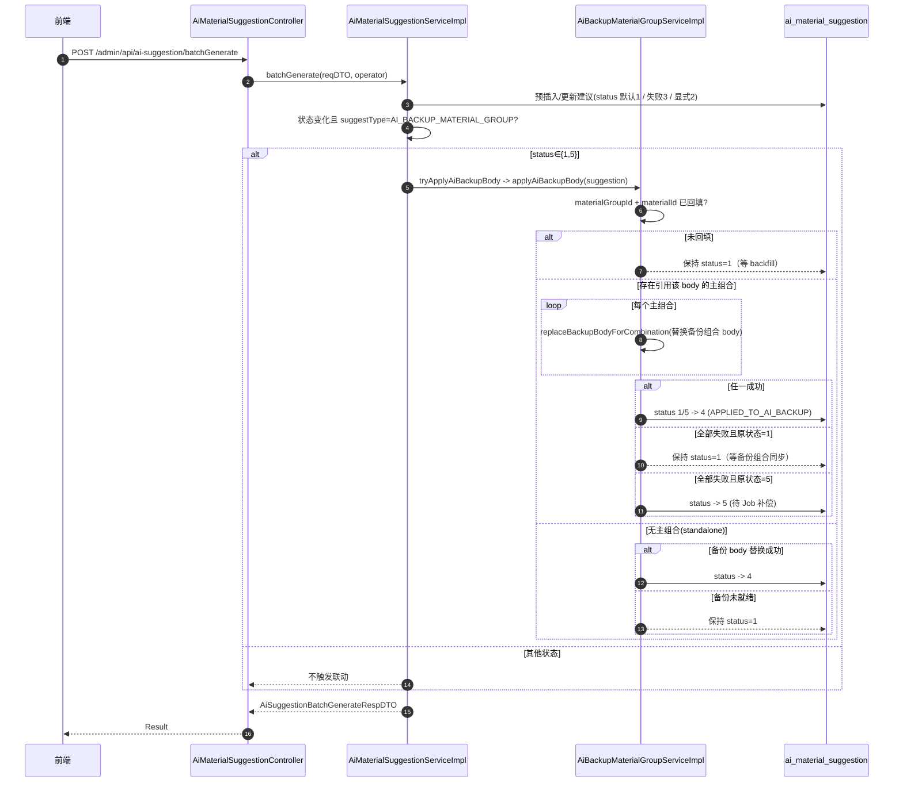
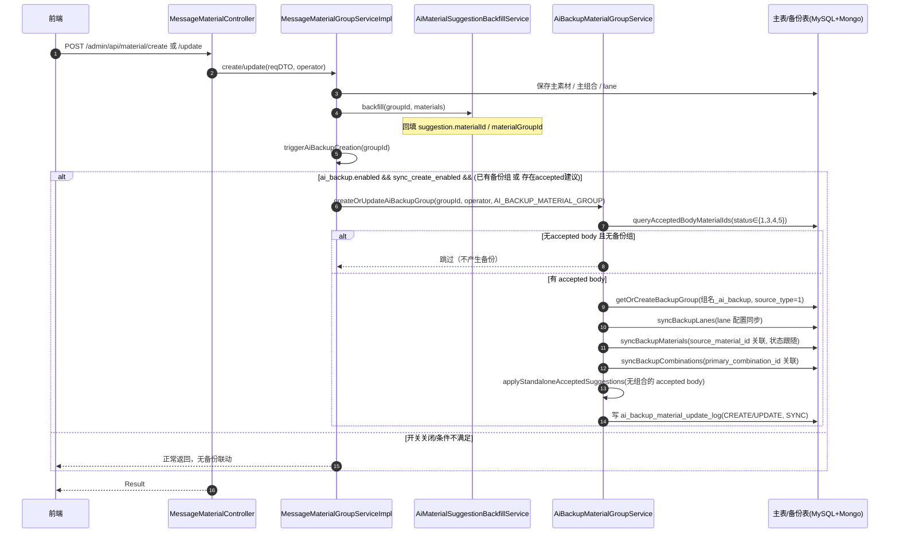
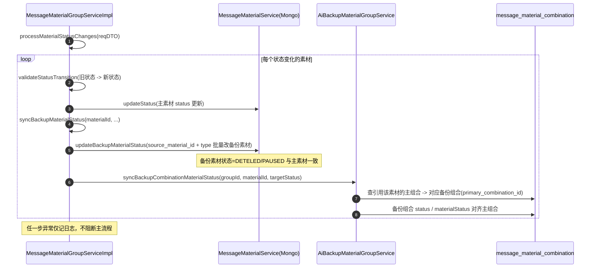
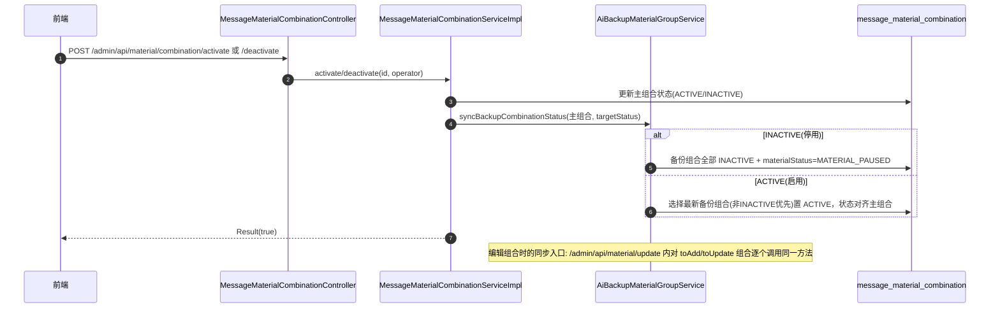
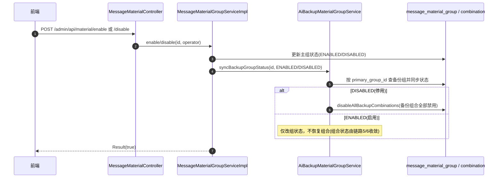
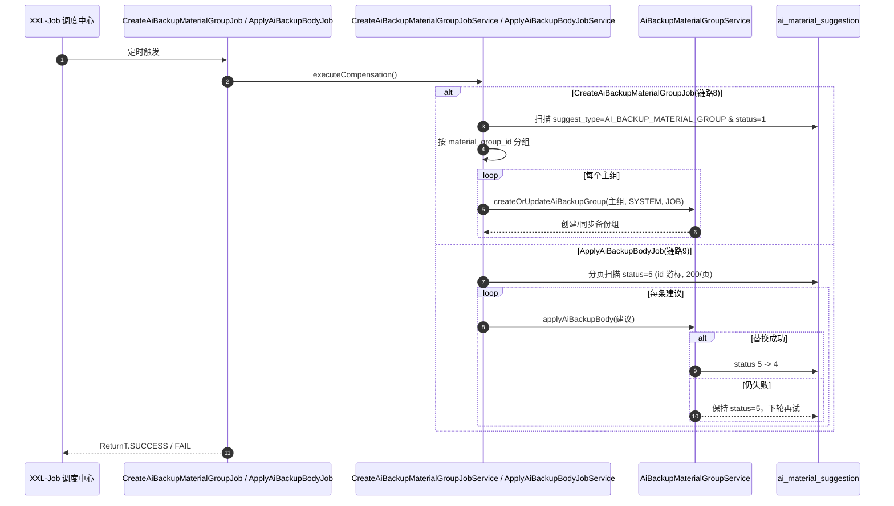

# AI 备份素材组（feature/zlc/0826-ai-backup-material）状态联动变更梳理

> 基线：`master`；变更分支：`feature/zlc/0826-ai-backup-material`（29 个提交，58 个文件，+4910/-91）
> 一句话总结：新增 **AI 备份素材组（AI Backup Material Group）** 能力——AI 建议被"接受"后自动生成一份可独立发送的备份素材组，并把主素材侧（分组启停 / 素材状态 / 组合状态 / 建议状态）的变更**单向联动**到备份侧；同时引入新的建议状态机、稳定性等级统计（Redis 缓存）与 3 个补偿 Job。

---

## 0. 速览：改了啥 / 联动什么 / 影响什么

| 改动点 | 入口（HTTP / Job） | 联动 & 影响 |
|---|---|---|
| 新增建议状态机（1~5） | 新增枚举 `AiMaterialSuggestionStatusEnum` | `ai_material_suggestion.status` 语义重定义（原 0~4 废弃口径），状态 1/5 触发 body 替换 |
| 批量生成建议 | `POST /admin/api/ai-suggestion/batchGenerate`（新增） | 落库建议（默认 1 接受/2 不接受/3 失败）→ 状态 1 或 5 → 触发备份组合 body 替换（1→4/5） |
| AI 备份素材状态反馈 | `POST /admin/api/ai-suggestion/backup-material/feedbackAiBackupStatus`（新增） | 前端把建议状态/评分回写（不触发联动，仅落库） |
| AI 备份素材查询 | `POST /admin/api/ai-suggestion/backup-material/listAiBackupMaterials`（新增） | 新增只读查询，按建议状态汇总成功/失败数 |
| 主素材组创建/编辑 | `POST /admin/api/material/create`、`/update` | 结尾钩子 `triggerAiBackupCreation` → 全量同步/创建备份组（组、lane、素材、组合），开关 `ai_backup.enabled` + `ai_backup.sync_create_enabled` 控制，异常吞掉 |
| 素材状态变更（删/停） | 同上（create/update 请求体内的 material.status） | `syncBackupMaterialStatus`：按 `source_material_id` 把备份素材状态改成一致，并联动备份组合的 materialStatus/status |
| 组合激活/停用 | `POST /admin/api/material/combination/activate`、`/deactivate` | `syncBackupCombinationStatus`：备份组合状态跟随主组合（停用→备份组合禁用） |
| 组合编辑（手动组合增改） | `POST /admin/api/material/update` 内部 | 编辑后逐个同步备份组合状态 |
| 素材组启用/停用 | `POST /admin/api/material/enable`、`/disable` | `syncBackupGroupStatus`：备份组状态跟随；DISABLED 时级联禁用备份组合 |
| 主列表查询 | `POST /admin/api/material/listAll` | 增加过滤条件，**AI 备份组不再出现在主列表** |
| 补偿创建备份组 | XXL-Job `CreateAiBackupMaterialGroupJob` | 扫描 status=1 且未建备份组的主组，补偿 `createOrUpdateAiBackupGroup` |
| 补偿 body 替换 | XXL-Job `ApplyAiBackupBodyJob` | 扫描 status=5 分页（200/页）重试替换，成功 5→4 |
| 稳定性等级统计 | `POST /admin/api/material/page`、`/groupDetail` + XXL-Job `RefreshMaterialGroupStabilityCacheJob` | 组列表/详情返回 `templateStats`（Redis 缓存 `material_group_stability:*`，TTL 35min，刷新窗口 14 天）；备份组稳定性低于 `ai_backup.min_stability_level`（默认 B）时发送侧不可用 |
| 直发场景判定调整（合入的修复） | `TaskMessageSenderImpl` | 直发场景由"看模板类型"改为"按 matchStrategy 类名"解析，行为有变化（见 4.2） |
| 表结构变更 | SQL `doc/sql/ai_backup_material_group.sql` | 主表/组合表加列、`name` 扩容 255、新增日志表 `ai_backup_material_update_log` |

---

## 1. 变更总览

### 1.1 目的
- AI 建议被用户**接受**后，不再只停留在"建议"层面，而是真正生成一份**可发送的备份素材组**（body 使用 AI 生成内容替换）。
- 备份组与主组**解耦存储、单向同步**：主组后续的启停、素材删/停、组合停用等操作，自动联动到备份组，保证备份侧不发送已停用的内容。
- 配套：稳定性等级（Stability Level）门槛 + 建议状态回显 + 失败补偿 Job，形成一个闭环。

### 1.2 涉及模块
| 模块 | 改动 |
|---|---|
| whatsapp-crm-common | 新增 `AiMaterialSuggestionStatusEnum`、`SourceTypeEnum`、`AiMaterialSuggestionConstants`；`SuggestTypeEnum` 增加 `AI_BACKUP_MATERIAL_GROUP`；`BusinessConfig` 增加 5 个开关 |
| whatsapp-crm-api | `AiMaterialSuggestionController` 新增 3 个接口 |
| whatsapp-crm-data | 新增 `AiBackupMaterialGroupService(Impl)`（核心，1570 行）、`AiBackupStabilityService`、`MaterialGroupStabilityStatsService`、`AiBackupMaterialUpdateLog`；改造建议/素材组/组合服务增加联动钩子；`MessageMaterial` 增加 `source_material_id` |
| whatsapp-crm-service / job | 新增 3 个 XXL-Job（body 替换补偿、备份组创建补偿、稳定性缓存刷新） |
| doc/sql | 新 DDL：`ai_backup_material_group.sql`；`ai_material_suggestion.sql` 状态注释更新 |

### 1.3 新增配置开关（BusinessConfig）
| 配置项 | 默认值 | 说明 |
|---|---|---|
| `ai_backup.enabled` | false | AI 备份素材组总开关（创建/同步触发前提） |
| `ai_backup.sync_create_enabled` | true | 同步创建联动开关 |
| `ai_backup.min_stability_level` | B | 备份组稳定性最低等级，低于则发送侧查询不到 |
| `ai_suggestion.batch_generate_size` | 5 | 批量生成接口每次处理的最大素材数 |
| `material.group.stability.redisSwitch` | false | 稳定性统计走 Redis 缓存开关 |
| `material.group.stability.redisRefreshDays` | 14 | 刷新窗口（天） |
| `material.group.stability.redisCacheMinutes` | 35 | Redis 缓存 TTL（分钟） |

### 1.4 数据结构变更
- `message_material_group`：新增 `primary_group_id`、`source_type`（0 手动/1 AI）、`ai_suggest_type`；`name` 扩容 varchar(255)。
- `message_material_combination`：新增 `primary_combination_id`（带索引）、`source_type`。
- Mongo `message_material`：新增 `source_material_id`（备份拷贝记录主素材 ID）。
- 新增表 `ai_backup_material_update_log`（备份组变更操作日志，含主组/备份组 ID、操作类型、触发源、前后 JSON）。
- 建议表 `ai_material_suggestion.status` 注释更新为新状态口径。

---

## 2. 状态定义与状态机

### 2.1 建议状态机（新增 `AiMaterialSuggestionStatusEnum`，`ai_material_suggestion.status`）

| code | 枚举 | 含义 | 能否进入备份组 |
|---|---|---|---|
| 1 | ACCEPTED_FOR_AI_BACKUP | 已接受，等待替换 body | ✅（getAcceptedStatuses） |
| 2 | NOT_ACCEPTED_FOR_AI_BACKUP | 未接受 | ❌ |
| 3 | GENERATION_FAILED | AI 生成失败 | ✅ |
| 4 | APPLIED_TO_AI_BACKUP | body 已成功替换到备份模板 | ✅ |
| 5 | APPLIED_TO_AI_BACKUP_FAILED | body 替换失败（可补偿重试） | ✅ |

> 可替换状态：仅 1、5 会触发/允许 body 替换（`applyAiBackupBody` 前置判断）。
> 状态集合：`getAcceptedStatuses()={1,3,4,5}`、`getNotAcceptedStatuses()={2}`。

**状态迁移图（AI_BACKUP_MATERIAL_GROUP 类型建议）：**
```
[generate 落库] ──► 2 (默认未接受)
[batchGenerate 落库] ──► 3 (生成失败) / 1 (接受) / 2 (显式不接受)
                         │ 1
                         ▼
            applyAiBackupBody（替换备份组合 body）
              ├─ 成功 ──► 4
              ├─ 备份组合未同步就绪 ├─► 保持 1（等下次同步/补偿）
              └─ 失败/异常 ──► 5
                                   │（ApplyAiBackupBodyJob 补偿，或 batchGenerate 再次置 1/5）
                                   ▼
                             重试替换 ──► 4
```

### 2.2 涉及的其它状态枚举（沿用既有，不做新定义）
- 素材组：`MaterialGroupStatusEnum.ENABLED / DISABLED`（主组 → 备份组单向同步）。
- 组合：`MaterialCombinationStatusEnum.ACTIVE / INACTIVE`（主组合 → 备份组合同步，停用时备份组合 `materialStatus=MATERIAL_PAUSED`）。
- 素材：`MaterialStatusEnum.ACTIVE / PAUSED / DELETED`（按 `source_material_id` 同步到备份素材）。
- 新增 `SourceTypeEnum`：`MANUAL(0)` / `AI(1)`，标识备份侧数据来源。

---

## 3. 变更链路明细（入口 → 关键方法 → 状态变化 → 补偿/失败处理）

> 以下 HTTP 路径均含前缀 `/admin/api`。

### 链路 1：AI 建议批量生成 → 备份 body 替换（新增接口，核心链路）
- **入口**：`AiMaterialSuggestionController.batchGenerate` → `POST /admin/api/ai-suggestion/batchGenerate`
- **方法链**：
  1. `AiMaterialSuggestionServiceImpl.batchGenerate`（上限 `ai_suggestion.batch_generate_size`，默认 5）
  2. `preInsertRecords`：新记录默认 status=1（前端可显式传 2=不接受）；`resolveFailureStatus`：生成异常写 3（显式不接受则 2）
  3. 已存在记录更新：status 变化 → `tryApplyAiBackupBody`
  4. `tryApplyAiBackupBody`：仅 `suggestType=AI_BACKUP_MATERIAL_GROUP` 且 status∈{1,5} 时 → `AiBackupMaterialGroupServiceImpl.applyAiBackupBody`
- **applyAiBackupBody 内部逻辑**：
  - 前置：`materialGroupId` + `materialId` 必须已回填（由 `AiMaterialSuggestionBackfillService.backfill` 在素材保存时回写）；未回填则保持 status=1 等待
  - 按 `material_group_id + body_material_id = suggestion.material_id` 找到主组合
  - 无主组合：尝试 standalone 备份 body 替换（`replaceStandaloneBackupBody`），成功 → 4，未就绪保持 1
  - 有主组合：逐个 `replaceBackupBodyForCombination`，任一成功 → 4；全失败且原状态=1 → 保持 1（等备份组合同步）；原状态=5 → 5 等待补偿；异常 → 5
- **状态变化**：1/5 → 4（成功）| 1 → 1（未就绪）| 1/5 → 5（失败）
- **失败/补偿**：`ApplyAiBackupBodyJob` 扫描 status=5 重试（见链路 9）


#### 链路 1 时序图




### 链路 2：AI 建议生成（改造）
- **入口**：`AiMaterialSuggestionController.generate` → `POST /admin/api/ai-suggestion/generate`
- **方法链**：`AiMaterialSuggestionServiceImpl.generate` → `generateForLane`
- **改动**：落库时若 `suggestType=AI_BACKUP_MATERIAL_GROUP`，初始 status=2（未接受），即**单条生成默认不接受**，需前端在批量接口或反馈接口显式接受
- **状态变化**：创建即 2，不触发任何联动

### 链路 3：AI 备份素材状态反馈（新增接口）
- **入口**：`AiMaterialSuggestionController.feedbackAiBackupStatus` → `POST /admin/api/ai-suggestion/backup-material/feedbackAiBackupStatus`
- **方法链**：`AiMaterialSuggestionServiceImpl.feedbackAiBackupStatus`
- **逻辑**：按 `suggestionStatus`（1~5）+ 评分/备注直接回写建议（`updateById`），**不触发任何联动**，属于前端状态回显
- **关联查询**：`POST /admin/api/ai-suggestion/backup-material/listAiBackupMaterials`（`listAiBackupMaterials`）：汇总建议状态与成功/失败计数（非 not-accepted 即算成功）

### 链路 4：主素材组 创建/编辑 → 备份组全量同步（重点联动）
- **入口**：`MessageMaterialController.create / update` → `POST /admin/api/material/create`、`/update`
  - create：`MessageMaterialGroupServiceImpl.create`（`crateMaterialGroup` 尾部）
  - update：`MessageMaterialGroupServiceImpl.update`（`updateMaterialGroup` 尾部）
- **方法链**：`backfill`（回填建议 materialId/materialGroupId）→ `triggerAiBackupCreation` → `AiBackupMaterialGroupService.createOrUpdateAiBackupGroup`
- **triggerAiBackupCreation 前置条件**：`ai_backup.enabled=true` 且 `ai_backup.sync_create_enabled=true`；且「已存在备份组」或「存在 accepted 建议」
- **createOrUpdateAiBackupGroup 内部（核心同步）**：
  1. 查 accepted body 素材集合（status∈{1,3,4,5}）
  2. 过滤出 body 被接受的主组合（`targetPrimaryCombinations`）
  3. 无 accepted body 且无备份组 → 直接跳过；有备份组 → 禁用全部备份组合 + 清理 body 备份素材（增量清理 `cleanupBackupMaterials`）
  4. `getOrCreateBackupGroup`：创建/获取备份组（名称 `主组名_ai_backup`，`primary_group_id`/`source_type=1`/`ai_suggest_type=AI_BACKUP_MATERIAL_GROUP`，状态跟随主组）
  5. `syncBackupLanes`：同步 lane 配置
  6. `syncBackupMaterials`：按类型复制素材（备份素材记录 `source_material_id=主素材ID`，状态跟随主素材；重复 ID 去重；失效/删除素材清理）
  7. `syncBackupCombinations`：按主组合生成备份组合（`primary_combination_id` 关联，body 指向备份素材）
  8. `applyStandaloneAcceptedSuggestions`：无手动组合的 accepted body 单独同步
  9. 落 `ai_backup_material_update_log`（operate_type=CREATE/UPDATE，trigger_source=SYNC）
- **状态变化**：备份组/备份素材/备份组合创建或状态对齐主侧；建议本身不变
- **失败/补偿**：`CreateAiBackupMaterialGroupJob`（见链路 8）


#### 链路 4 时序图




### 链路 5：素材状态变更 → 备份素材 & 组合同步（在 create/update 请求内）
- **入口**：同链路 4 的 `POST /admin/api/material/create`、`/update`（请求体内素材 `status` 字段变化）
- **方法链**：`MessageMaterialGroupServiceImpl.processMaterialStatusChanges` → `syncBackupMaterialStatus`
- **逻辑**：
  1. 先 `validateStatusTransition`（已删除不能再改）
  2. 变更主素材状态（`messageMaterialService.updateStatus`）
  3. `messageMaterialService.updateBackupMaterialStatus(sourceMaterialId, type, targetStatus)`：按 `source_material_id + type` 批量更新备份素材状态（排除已 DELETED）
  4. `aiBackupMaterialGroupService.syncBackupCombinationMaterialStatus`：找到引用该素材的主组合 → 查对应备份组合，把 `materialStatus/status` 对齐主组合
- **状态变化**：备份素材 `status` 与主素材一致；备份组合 `materialStatus/status` 与主组合一致
- **失败处理**：整段 try-catch 吞异常，主流程不受影响；备份侧数据靠下次同步收敛


#### 链路 5 时序图




### 链路 6：组合 激活/停用/编辑 → 备份组合状态同步
- **入口 A**：`MessageMaterialCombinationController.activate / deactivate` → `POST /admin/api/material/combination/activate`、`/deactivate`
  - `MessageMaterialCombinationServiceImpl.activate` / `deactivate` 更新后 → `aiBackupMaterialGroupService.syncBackupCombinationStatus(combination, ACTIVE/INACTIVE, operator)`
- **入口 B**：`MessageMaterialController.update`（`POST /admin/api/material/update`）内部编辑手动组合（`updateManualMaterialCombinations` 等）→ 对 toAdd/toUpdate 的主组合逐个 `syncBackupCombinationStatus`
- **syncBackupCombinationStatus 内部**：
  - 按 `primary_combination_id + source_type=1` 查备份组合
  - INACTIVE（或停用）→ `disableBackupCombinations`：备份组合置 INACTIVE，且 `materialStatus=MATERIAL_PAUSED`
  - ACTIVE → 选一个备份组合激活（优先非 INACTIVE、最新 utime/id），`status/materialStatus` 对齐主组合
- **状态变化**：备份组合 ACTIVE ↔ INACTIVE、materialStatus 跟随
- **失败处理**：try-catch 吞异常


#### 链路 6 时序图




### 链路 7：素材组 启用/停用 → 备份组状态同步
- **入口**：`MessageMaterialController.enable / disable` → `POST /admin/api/material/enable`、`/disable`
- **方法链**：`MessageMaterialGroupServiceImpl.enable / disable` 更新主组后 → `aiBackupMaterialGroupService.syncBackupGroupStatus(id, ENABLED/DISABLED, operator)`
- **内部**：按 `primary_group_id + ai_suggest_type=AI_BACKUP_MATERIAL_GROUP + source_type=1` 查备份组；备份组 status 同步更新；**DISABLED 时**额外 `disableAllBackupCombinations`（备份组合全部 INACTIVE + MATERIAL_PAUSED），ENABLED 只改组状态不还原组合
- **状态变化**：备份组 ENABLED ↔ DISABLED；停用时备份组合全禁用
- **失败处理**：try-catch 吞异常


#### 链路 7 时序图




### 链路 8：XXL-Job 补偿创建备份组
- **入口**：`CreateAiBackupMaterialGroupJob`（`@XxlJob("CreateAiBackupMaterialGroupJob")`）→ `CreateAiBackupMaterialGroupJobService.executeCompensation` → `createCompensation`
- **逻辑**：扫描 `suggest_type=AI_BACKUP_MATERIAL_GROUP and status=1` 的建议 → 按 `material_group_id` 分组 → 逐个 `createOrUpdateAiBackupGroup`（operator=SYSTEM，trigger_source=JOB）
- **适用场景**：同步创建失败/开关未开期间累积的接受建议

### 链路 9：XXL-Job 补偿 body 替换
- **入口**：`ApplyAiBackupBodyJob`（`@XxlJob("ApplyAiBackupBodyJob")`）→ `ApplyAiBackupBodyJobService.executeCompensation` → `applyAiBackupBodyCompensation`
- **逻辑**：分页（200/页，按 id 增量游标）扫描 `suggest_type=AI_BACKUP_MATERIAL_GROUP and status=5` → 逐条 `applyAiBackupBody` 重试（成功 5→4）
- **注意**：符合"MySQL in 批量查询数据量过大时分批"的经验——此处用 id 游标分页，未用大 in


#### 链路 8/9 时序图（补偿 Job）




### 链路 10：查询入口
- `POST /admin/api/material/listAll`（`MessageMaterialGroupServiceImpl.listAll`）：新增过滤 `ai_suggest_type IS NULL OR '' OR != AI_BACKUP_MATERIAL_GROUP` → **AI 备份组从主列表隐藏**
- `POST /admin/api/material/page`、`/groupDetail`：若 `material.group.stability.redisSwitch=true`，列表/详情填充 `templateStats`（Redis 命中 → 未命中 computeAndCache 后写缓存）；备份组详情返回 `primaryGroupId/sourceType/aiSuggestType`
- `AiBackupMaterialGroupService.getAiBackupMaterialGroup`（发送侧查询）：查稳定性等级（Redis，兼容旧格式纯字符串），低于 `ai_backup.min_stability_level` 返回 null（该备份组不可用）；只取 ACTIVE + materialStatus=NORMAL + 素材全 ACTIVE 的组合

### 链路 11：稳定性等级统计（附带变更）
- `MaterialGroupStabilityStatsService.computeAndCache`：按组统计模板/素材/WABA 数据并算稳定性等级，写 Redis（前缀 `material_group_stability:`，TTL 默认 35 分钟）；查询 in 每次分批 500
- XXL-Job `RefreshMaterialGroupStabilityCacheJob` → `RefreshMaterialGroupStabilityCacheJobService.refreshCache`：刷新 AI 备份组 + 近 14 天更新过的主素材组的稳定性缓存
- 影响：主列表/详情的统计数据来源切换（新开关默认关，不影响旧逻辑）

---

## 4. 对原主流程影响评估

### 4.1 隔离机制（整体较安全）
- 所有联动钩子均已 **try-catch 包裹并记录 error 日志**，异常不会回抛到主流程；
- 同步创建受 `ai_backup.enabled`（默认 **false**）控制，未开启时完全无备份同步；
- 稳定性 Redis 走独立开关 `material.group.stability.redisSwitch`（默认 false），不影响旧统计链路；
- 存量主素材组**不会**被历史同步：只有"已存在备份组 或 存在 accepted 建议"的组在保存时才会触发创建。

### 4.2 影响点清单（需要关注）

| # | 影响点 | 影响说明 | 风险 | 建议 |
|---|---|---|---|---|
| 1 | `ai_material_suggestion.status` 语义变更 | 旧代码中 0~4（pending/rated/adopted/rejected/ignored）与新 1~5 口径冲突；`generate` 单条接口对 AI_BACKUP 类型默认写 2，旧列表/feedback 逻辑按旧语义展示可能错位 | 中 | 确认前端 + 查询接口按新状态口径联调；存量 status=0 数据的处理策略需明确 |
| 2 | `listAll` 增加过滤 | AI 备份组不再出现在主素材组列表，若旧页面依赖"全量"可能少数据 | 低 | 备份组通过新接口/listAiBackupMaterials 查看 |
| 3 | `TaskMessageSenderImpl` 直发场景判定变化（合入的 direct-send 修复代码） | 旧：按 `templateType=UTILITY/everUtility/MARKETING` 判定 TRUE_UTILITY/EVER_UTILITY/TRUE_MARKETING；新：按 `matchStrategy` 提取类名匹配 `SendTrueUtilityByDirectSendStrategy / SendEverUtilityByDirectSendStrategy / SendMarkingByDirectSendStrategy`，**匹配不到返回 NONE**（不再回退模板属性判断） | 中 | 需确认直发场景的 matchStrategy 一定带策略类名；有回归测试 `TaskMessageSenderImplDirectSendSceneTest` 覆盖 |
| 4 | `message_material_group.name` 扩容 255 | 主表 DDL 变更，备份组名拼接 `_ai_backup` 需要空间 | 低 | 上线前执行 DDL |
| 5 | 组/组合表新增列 + 新日志表 | 全表新增列走 DDL；备份组合查询依赖 `idx_primary_combination_id` | 低 | 上线前执行 DDL，注意加列锁表窗口 |
| 6 | 稳定性统计新逻辑 | 走 Redis 后列表/详情统计口径与旧逻辑可能略有差异（TTL 内为缓存值） | 低 | 新开关灰度观察 |
| 7 | 发送侧 `getAiBackupMaterialGroup` 门槛 | 备份组稳定性低于 B 则发送侧查询为 null（该备份组不发），属新增能力不影响原主组发送 | 低 | 确认 min_stability_level 配置符合预期 |

### 4.3 结论
- 本分支对**原主流程（创建/编辑素材组、组合、素材的原有行为）无破坏性改动**：所有新增联动均挂新开关 + try-catch，默认关闭，开启与否不影响主链路正常完成。
- 需要重点验证的 3 处：① 建议状态新口径的前端联调；② 直发场景判定变化（TaskMessageSenderImpl）；③ DDL 上线（含 name 扩容、加列、新索引、新表）。

---

## 5. 附录

### 5.1 关键文件清单（按模块）
| 文件 | 说明 |
|---|---|
| `whatsapp-crm-common/.../enums/AiMaterialSuggestionStatusEnum.java` | 新状态机 1~5 |
| `whatsapp-crm-common/.../enums/SourceTypeEnum.java`、`SuggestTypeEnum.java` | 新增 AI 来源/建议类型 |
| `whatsapp-crm-common/.../constants/AiMaterialSuggestionConstants.java` | 常量（操作类型/触发源/备份组命名） |
| `whatsapp-crm-common/.../config/BusinessConfig.java` | 新增 5 个开关 |
| `whatsapp-crm-api/.../admin/AiMaterialSuggestionController.java` | 新增 batchGenerate / listAiBackupMaterials / feedbackAiBackupStatus |
| `whatsapp-crm-data/.../service/impl/AiBackupMaterialGroupServiceImpl.java` | 核心：创建/同步/替换/补偿（1570 行） |
| `whatsapp-crm-data/.../service/impl/MaterialGroupStabilityStatsService.java` | 稳定性统计 + Redis 缓存 |
| `whatsapp-crm-data/.../service/impl/AiMaterialSuggestionServiceImpl.java` | 建议落库 + 状态流转 + 反馈/查询 |
| `whatsapp-crm-data/.../service/impl/MessageMaterialGroupServiceImpl.java` | 主组创建/编辑/启停/素材状态联动钩子 |
| `whatsapp-crm-data/.../service/impl/MessageMaterialCombinationServiceImpl.java` | 组合激活/停用联动钩子 |
| `whatsapp-crm-data/.../mongo/service/MessageMaterialService(Impl).java` | updateBackupMaterialStatus（source_material_id 批量同步） |
| `whatsapp-crm-data/.../task/send/impl/TaskMessageSenderImpl.java` | 直发场景判定调整（合入修复） |
| `whatsapp-crm-data/.../xxljob/*.java` + `whatsapp-crm-job*/.../job/task/*Job.java` | 3 个补偿/刷新 Job |
| `doc/sql/ai_backup_material_group.sql` | DDL（字段、索引、日志表） |

### 5.2 涉及的表
- `message_material_group`（+primary_group_id、source_type、ai_suggest_type；name 扩容 255）
- `message_material_combination`（+primary_combination_id、source_type；+idx_primary_combination_id）
- `message_material`（Mongo，+source_material_id）
- `ai_material_suggestion`（status 语义更新）
- `ai_backup_material_update_log`（新增）

### 5.3 新增 XXL-Job 汇总
| Job 名 | 作用 | 扫描条件 |
|---|---|---|
| CreateAiBackupMaterialGroupJob | 补偿创建备份组 | status=1 且未建备份组 |
| ApplyAiBackupBodyJob | 补偿 body 替换 | status=5（id 游标 200/页） |
| RefreshMaterialGroupStabilityCacheJob | 刷新稳定性缓存 | AI 备份组 + 近 14 天更新主组 |
