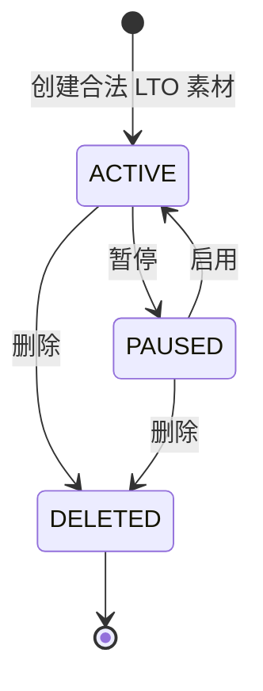
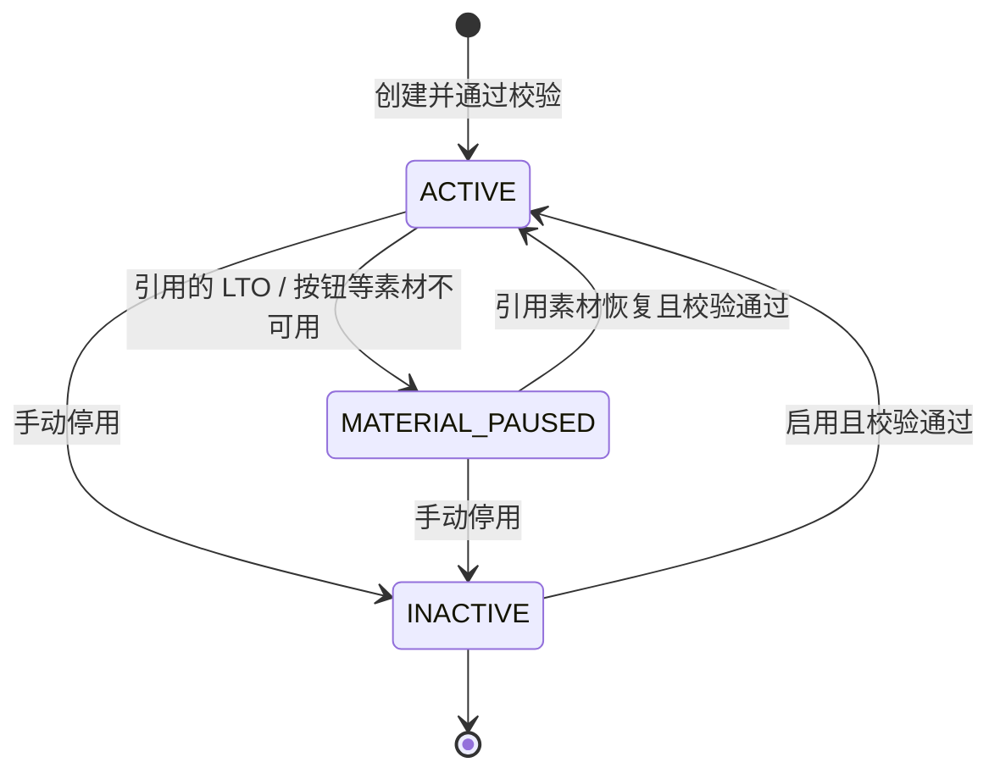
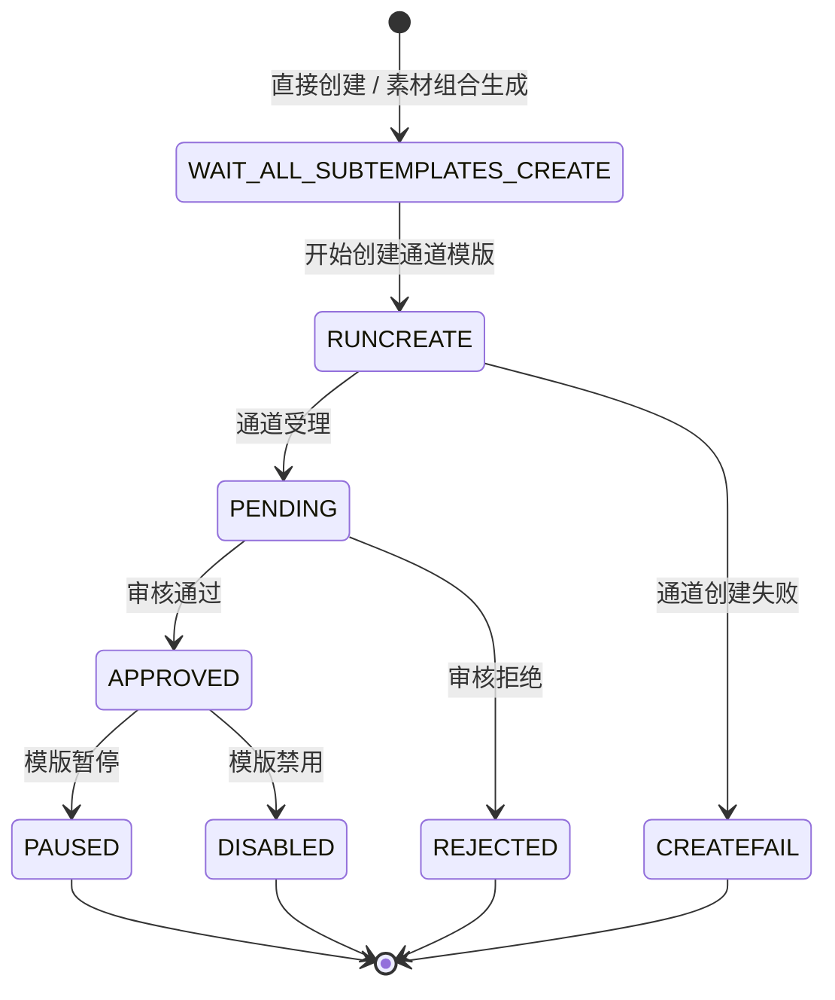
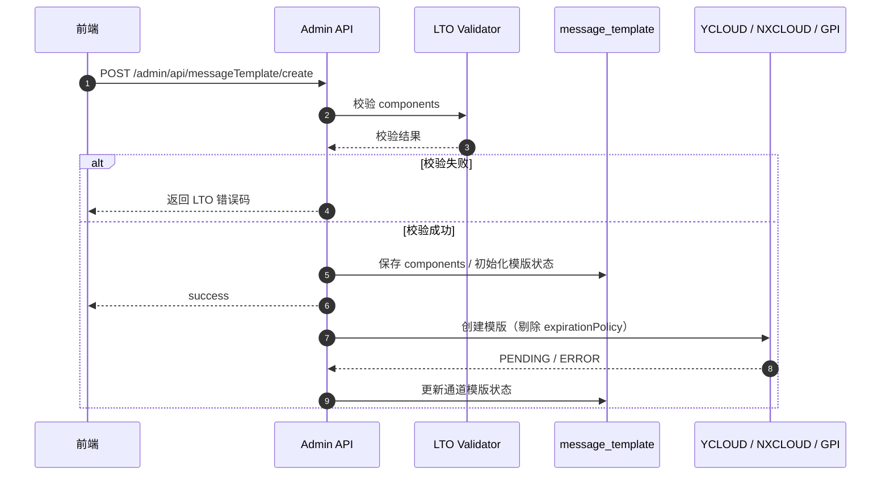
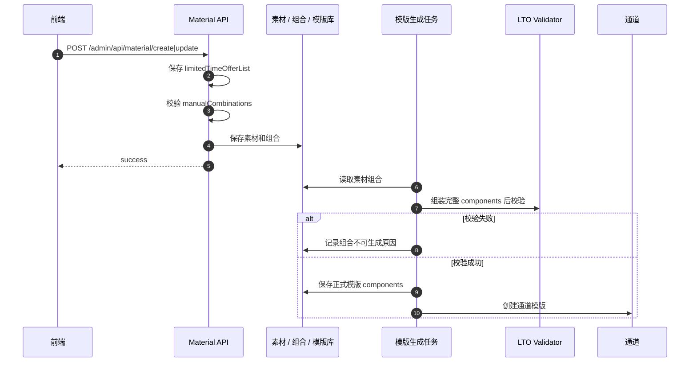
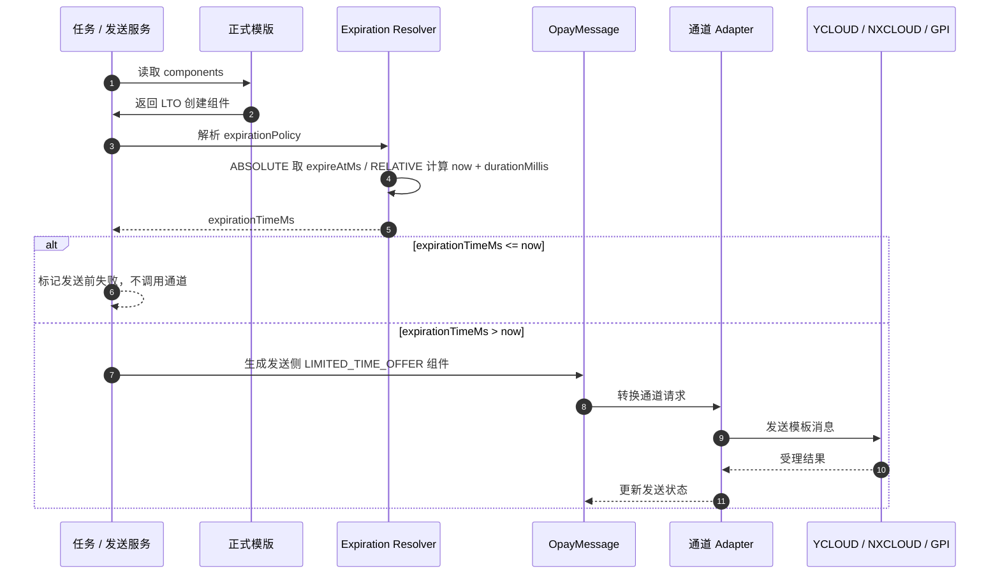
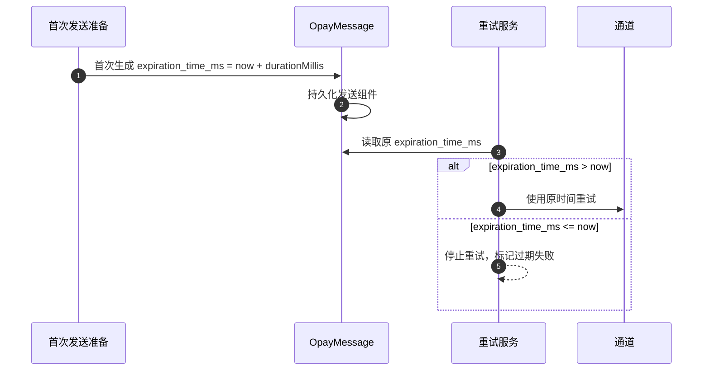

# 1. 背景与目标

## 1.1 背景

WhatsApp 支持 Limited-Time Offer Templates（以下简称 LTO），可以在优惠码消息中展示优惠信息、到期时间和倒计时。项目需要在现有模版体系中支持该能力。

## 1.2 范围

| 通道 | 是否支持 | 说明 |
| --- | --- | --- |
| YCLOUD | 支持 | SDK 已有 LTO 模型 |
| NXCLOUD | 支持 | 按通道协议扩展模型 |
| GPI | 支持 | 按 Meta / GPI 协议扩展模型 |
| EIGHTX8 | 不支持 | 官方确认暂时不支持 |
| ADA | 待确认反馈 |  |
| VONAGE / 其他 | 暂不关注 | 未使用 |

## 1.3 目标

1. 支持直接创建 LTO 正式模版。
2. 支持通过素材模版、素材组合生成 LTO 正式模版。
3. 已有素材模版可以新增 LTO 素材。
4. 一个素材模版下可以配置多个 LTO 素材。
5. 素材组合可以选择一个 LTO 素材，也可以不选择 LTO。
6. LTO 到期策略随正式模版固化，发送阶段按策略计算真实到期时间。
7. 存量普通模版、OTP 模版、UTILITY 模版行为不变。

---

# 2. 总体设计

## 2.1 核心设计

LTO 到期策略作为模版组件的一部分，保存在正式模版 `message_template.components` 中。

创建模版时，用户配置：

```json
{
  "type": "LIMITED_TIME_OFFER",
  "limited_time_offer": {
    "text": "Offer ends soon",
    "has_expiration": true,
    "expirationPolicy": {
      "type": "RELATIVE",
      "durationMillis": 1800000
    }
  }
}
```

发送时，系统读取该策略并计算真实到期时间：

```json
{
  "type": "limited_time_offer",
  "parameters": [
    {
      "type": "limited_time_offer",
      "limited_time_offer": {
        "expiration_time_ms": 1790000000000
      }
    }
  ]
}
```

要点：

1. `expirationPolicy` 是 CRM 内部字段，不下发给通道。
2. 通道创建时只下发 `text` 和 `has_expiration`。
3. 发送时只下发通道需要的 `expiration_time_ms`。
4. 不新增配置表。
5. `message_template` 表结构不变，继续复用 `components` JSON。
6. 发送阶段不通过 `templateVariableMap` 覆盖到期时间。

## 2.2 到期策略类型

### ABSOLUTE

绝对到期时间。

用户输入：

```json
{
  "type": "ABSOLUTE",
  "expireAt": "2026-09-04T12:10:10",
  "timezoneId": "Asia/Jakarta",
  "countryCode": "ID"
}
```

后端校验后保存：

```json
{
  "type": "ABSOLUTE",
  "expireAtMs": 1790000000000,
  "timezoneId": "Asia/Jakarta",
  "countryCode": "ID",
  "sourceExpression": "2026-09-04 12:10:10"
}
```

发送时直接使用：

```text
expirationTimeMs = expireAtMs
```

### RELATIVE

相对到期时间，例如“发送后 30 分钟”。

用户配置：

```json
{
  "type": "RELATIVE",
  "durationMillis": 1800000
}
```

首次发送准备时计算：

```text
expirationTimeMs = 首次发送准备时间 + durationMillis
```

重试时复用首次计算结果，不能每次重试重新顺延。

## 2.3 时区

绝对时间必须带时区。

支持时区：

| 国家 | 时区 |
| --- | --- |
| 尼日利亚 | `Africa/Lagos` |
| 印尼 | `Asia/Jakarta` |
| 印尼 | `Asia/Makassar` |
| 印尼 | `Asia/Jayapura` |

前端可以按国家给默认值：

```text
ID -> Asia/Jakarta
NG -> Africa/Lagos
```

但后端仍应显式保存和校验 `timezoneId`。

一个绝对时间表示全球同一个时间点。例如：

```text
Asia/Jakarta 12:10 = Africa/Lagos 08:10
```

如果希望印尼和尼日利亚分别在本地 12:10 过期，这不是模板级绝对时间，需要后续扩展发送阶段按用户国家计算。

## 2.4 素材模版设计

素材模版不新增固定 LTO 标记。

已有素材模版可以新增 LTO 素材。一个素材模版下可以有多个 LTO 素材。

`message_material.type` 扩展：

```text
HEADER / BODY / FOOTER / BUTTONS / LIMITED_TIME_OFFER
```

每个 LTO 素材的 `element` 使用 `OpayTemplateComponent`。

## 2.5 素材组合设计

`message_material_combination` 增加可选 LTO 槽位：

```sql
ALTER TABLE message_material_combination
    ADD COLUMN limited_time_offer_material_id varchar(64) NOT NULL DEFAULT '' COMMENT 'Limited-time offer material ID; empty means no limited-time offer component';
```

Java 字段：

```java
private String limitedTimeOfferMaterialId;
```

语义：

| 值 | 含义 |
| --- | --- |
| `''` | 该组合没有 LTO，生成普通模版 |
| 非空 | 该组合使用指定 LTO 素材，生成限时优惠模版 |

一个组合最多引用一个 LTO 素材；一个最终模版最多包含一个 LTO 组件。

无 LTO 组合继续保留，存量组合行为不变。

## 2.6 后续扩展方向

一期发送阶段只读取模版组件中的到期策略。

后续如果需要更灵活的能力，可以在发送阶段扩展 resolver：

```text
1. 优先读取模板 components 中的 expirationPolicy；
2. 否则读取 templateVariableMap.limitedTimeOfferExpirationTimeMs；
3. 否则失败。
```

可支持的方向包括：

| 扩展方向 | 说明 |
| --- | --- |
| 任务级覆盖 | 同一个模板在不同任务中使用不同到期时间 |
| 用户级覆盖 | 同一任务中不同用户使用不同到期时间 |
| 国家级本地到期 | 按用户国家计算本地截止时间 |
| 动态优惠码 | `COPY_CODE` 优惠码按用户或活动动态生成 |
| 策略模板化 | 将到期策略抽象成可复用活动策略对象 |

一期不实现这些扩展，但发送阶段建议收敛到统一的 expiration resolver，避免后续改动散落在模板渲染逻辑中。

---

# 3. 数据模型与状态机

## 3.1 `message_template`

表结构不变。

LTO 策略继续保存在 `components` JSON 中。

ABSOLUTE 示例：

```json
[
  {
    "type": "LIMITED_TIME_OFFER",
    "limited_time_offer": {
      "text": "Offer ends soon",
      "has_expiration": true,
      "expirationPolicy": {
        "type": "ABSOLUTE",
        "expireAtMs": 1790000000000,
        "timezoneId": "Asia/Jakarta",
        "countryCode": "ID",
        "sourceExpression": "2026-09-04 12:10:10"
      }
    }
  }
]
```

RELATIVE 示例：

```json
[
  {
    "type": "LIMITED_TIME_OFFER",
    "limited_time_offer": {
      "text": "Offer ends soon",
      "has_expiration": true,
      "expirationPolicy": {
        "type": "RELATIVE",
        "durationMillis": 1800000
      }
    }
  }
]
```

## 3.2 `message_material`

`message_material` 是 MongoDB 集合。

`type` 扩展：

```text
HEADER / BODY / FOOTER / BUTTONS / LIMITED_TIME_OFFER
```

每个 LTO 素材的 `element` 使用 `OpayTemplateComponent`。

一个素材模版下可以配置多个 LTO 素材。

## 3.3 `message_material_combination`

新增字段：

```sql
ALTER TABLE message_material_combination
    ADD COLUMN limited_time_offer_material_id varchar(64) NOT NULL DEFAULT '' COMMENT 'Limited-time offer material ID; empty means no limited-time offer component';
```

Java 字段：

```java
private String limitedTimeOfferMaterialId;
```

语义：

| 值 | 含义 |
| --- | --- |
| `''` | 该组合没有 LTO，生成普通模版 |
| 非空 | 该组合使用指定 LTO 素材，生成限时优惠模版 |

组合去重 key 需要扩展为：

```text
headerMaterialId
+ limitedTimeOfferMaterialId
+ bodyMaterialId
+ footerMaterialId
+ buttonsMaterialId
```

否则同一组普通素材搭配不同 LTO 时会被误判为重复组合。

## 3.4 Java 统一模型

### 创建侧

`OpayTemplateComponent` 新增组件类型：

```java
LIMITED_TIME_OFFER
```

新增字段：

```java
@JSONField(name = "limited_time_offer")
private LimitedTimeOffer limitedTimeOffer;
```

内部类：

```java
@Data
public static class LimitedTimeOffer {

    private String text;

    @JSONField(name = "has_expiration")
    private Boolean hasExpiration;

    private ExpirationPolicy expirationPolicy;
}

@Data
public static class ExpirationPolicy {

    private ExpirationTypeEnum type;

    private Long expireAtMs;

    private Long durationMillis;

    private String timezoneId;

    private String countryCode;

    private String sourceExpression;
}
```

### 发送侧

`OpayComment.Template.Component` 新增：

```java
LIMITED_TIME_OFFER
```

`ParameterType` 新增：

```java
limited_time_offer
```

`Parameter` 新增：

```java
@JSONField(name = "limited_time_offer")
private LimitedTimeOffer limitedTimeOffer;
```

内部类：

```java
@Data
public static class LimitedTimeOffer {

    @JSONField(name = "expiration_time_ms")
    private Long expirationTimeMs;
}
```

## 3.5 LTO 素材状态机



规则：

- `ACTIVE` 素材可以被组合引用。
- `PAUSED` / `DELETED` 素材不能被新组合引用。
- 已引用不可用素材的 ACTIVE 组合应置为不可用或 `MATERIAL_PAUSED`。
- 已生成的正式模版不受素材后续状态影响。

## 3.6 素材组合状态机



规则：

- 组合引用 LTO 时，`limitedTimeOfferMaterialId` 不能为空。
- 组合不引用 LTO 时，`limitedTimeOfferMaterialId = ''`。
- LTO 素材禁用后，不能通过清空 LTO 槽位的方式自动降级为普通组合。

## 3.7 正式模版状态机



LTO 不引入新的模版状态，只影响创建前校验和发送前处理。

---

# 4. 系统内部接口与前端参数变更

## 4.1 前端通用 LTO 组件结构

前端请求 / 响应中的 LTO 组件结构如下。

RELATIVE：

```json
{
  "type": "LIMITED_TIME_OFFER",
  "limited_time_offer": {
    "text": "Offer ends soon",
    "has_expiration": true,
    "expirationPolicy": {
      "type": "RELATIVE",
      "durationMillis": 1800000
    }
  }
}
```

ABSOLUTE：

```json
{
  "type": "LIMITED_TIME_OFFER",
  "limited_time_offer": {
    "text": "Offer ends soon",
    "has_expiration": true,
    "expirationPolicy": {
      "type": "ABSOLUTE",
      "expireAt": "2026-09-04T12:10:10",
      "expireAtMs": 1790000000000,
      "timezoneId": "Asia/Jakarta",
      "countryCode": "ID",
      "sourceExpression": "2026-09-04 12:10:10"
    }
  }
}
```

字段说明：

| 字段 | 必填 | 说明 |
| --- | --- | --- |
| `type` | 是 | 固定 `LIMITED_TIME_OFFER` |
| `limited_time_offer.text` | 是 | 优惠提示文案，≤16 字符 |
| `limited_time_offer.has_expiration` | 是 | 是否展示到期时间 |
| `expirationPolicy.type` | 条件必填 | `ABSOLUTE` / `RELATIVE` |
| `expirationPolicy.expireAt` | ABSOLUTE 创建时必填 | 带时区语义的本地时间 |
| `expirationPolicy.timezoneId` | ABSOLUTE 必填 | IANA 时区 |
| `expirationPolicy.countryCode` | 建议传 | `ID` / `NG` |
| `expirationPolicy.expireAtMs` | 后端返回 | 后端转换后的 Unix 毫秒 |
| `expirationPolicy.durationMillis` | RELATIVE 必填 | 相对时长毫秒 |
| `expirationPolicy.sourceExpression` | 后端返回 | 原始输入，便于排查 |

## 4.2 素材模版创建 / 编辑

### 接口

```http
POST /admin/api/material/create
POST /admin/api/material/update
```

### 请求体变更

在现有请求体上新增：

```json
{
  "limitedTimeOfferList": []
}
```

完整 LTO 素材示例：

```json
{
  "limitedTimeOfferList": [
    {
      "id": "66f1a2b3c4d5e6f7a8b9c0d1",
      "status": "ACTIVE",
      "type": "LIMITED_TIME_OFFER",
      "subType": "NONE",
      "element": {
        "type": "LIMITED_TIME_OFFER",
        "limited_time_offer": {
          "text": "Offer ends soon",
          "has_expiration": true,
          "expirationPolicy": {
            "type": "RELATIVE",
            "durationMillis": 1800000
          }
        }
      }
    }
  ]
}
```

规则：

- 新增素材时 `id` 可不传；
- 可传前端临时引用 `tempKey`；
- 编辑已有素材时必须传 `id`；
- 编辑允许修改已有 LTO 素材，也允许新增 LTO 素材。

### 响应变更

`MessageMaterialGroupRespDTO` 新增：

```json
{
  "limitedTimeOfferList": []
}
```

每个元素是 `MessageMaterialRespDTO`：

```json
{
  "id": "66f1a2b3c4d5e6f7a8b9c0d1",
  "materialGroupId": 1001,
  "type": "LIMITED_TIME_OFFER",
  "subType": "NONE",
  "status": "ACTIVE",
  "element": {
    "type": "LIMITED_TIME_OFFER",
    "limited_time_offer": {
      "text": "Offer ends soon",
      "has_expiration": true,
      "expirationPolicy": {
        "type": "RELATIVE",
        "durationMillis": 1800000
      }
    }
  }
}
```

## 4.3 素材组合查询

### 接口

```http
POST /admin/api/material/combination/page
GET  /admin/api/material/combination/findTaskCombinationInfo
```

### 响应变更

`MessageMaterialCombinationRespDTO` 新增：

```json
{
  "limitedTimeOfferMaterialId": "66f1a2b3c4d5e6f7a8b9c0d1",
  "limitedTimeOfferMaterial": {
    "id": "66f1a2b3c4d5e6f7a8b9c0d1",
    "materialGroupId": 1001,
    "type": "LIMITED_TIME_OFFER",
    "status": "ACTIVE",
    "element": {
      "type": "LIMITED_TIME_OFFER",
      "limited_time_offer": {
        "text": "Offer ends soon",
        "has_expiration": true,
        "expirationPolicy": {
          "type": "RELATIVE",
          "durationMillis": 1800000
        }
      }
    }
  }
}
```

无 LTO 组合返回：

```json
{
  "limitedTimeOfferMaterialId": "",
  "limitedTimeOfferMaterial": null
}
```

## 4.4 手动组合参数变更

素材模版创建 / 编辑接口中的 `manualCombinations` 新增字段：

```json
{
  "manualCombinations": [
    {
      "headerMaterialRef": "header_1",
      "limitedTimeOfferMaterialRef": "lto_1",
      "bodyMaterialRef": "body_1",
      "footerMaterialRef": null,
      "buttonsMaterialRef": "buttons_1",
      "status": "ACTIVE"
    }
  ]
}
```

| 字段 | 说明 |
| --- | --- |
| `limitedTimeOfferMaterialRef` | 引用已有 LTO 素材 Mongo ObjectId，或本次新建素材的 `tempKey` |
| 为空 | 表示该组合无 LTO |
| 非空 | 表示该组合必须通过 LTO 组合校验 |

无 LTO 组合示例：

```json
{
  "headerMaterialRef": "header_1",
  "limitedTimeOfferMaterialRef": null,
  "bodyMaterialRef": "body_1",
  "footerMaterialRef": "footer_1",
  "buttonsMaterialRef": "buttons_1"
}
```

## 4.5 直接创建正式模版

### 接口

```http
POST /admin/api/messageTemplate/create
```

### 请求体变更

`MessageTemplateCreateReqDTO.components` 支持 LTO 组件。

示例：

```json
{
  "name": "limited_time_offer_2026",
  "language": "en_US",
  "category": "MARKETING",
  "components": [
    {
      "type": "LIMITED_TIME_OFFER",
      "limited_time_offer": {
        "text": "Offer ends soon",
        "has_expiration": true,
        "expirationPolicy": {
          "type": "RELATIVE",
          "durationMillis": 1800000
        }
      }
    },
    {
      "type": "BODY",
      "text": "Hi {{1}}, use code {{2}} before it expires.",
      "example": {
        "body_text": [
          ["Tom", "SAVE20"]
        ]
      }
    },
    {
      "type": "BUTTONS",
      "buttons": [
        {
          "type": "COPY_CODE",
          "example": "SAVE20"
        }
      ]
    }
  ],
  "selectedAgentAndWabaIds": []
}
```

## 4.6 openplatform 内部 SPI 变更

`TemplatePlugin` 新增：

```java
default boolean supportsTemplateComponent(
        OpayTemplateComponent.TemplateCommentTypeEnum componentType) {
    return false;
}
```

一期实现：

| 插件 | `LIMITED_TIME_OFFER` |
| --- | --- |
| `YCloudTemplatePlugin` | true |
| `NxCloudTemplatePlugin` | true |
| `GpiTemplatePlugin` | true |
| `EightX8TemplatePlugin` | false |
| 默认实现 | false |

创建前仍先判断：

```java
unifiedProviderService.supportedAgent(agent, UnifiedProviderSceneEnum.TEMPLATE)
```

再判断：

```java
templatePlugin.supportsTemplateComponent(LIMITED_TIME_OFFER)
```

---

# 5. 核心流程与时序图

## 5.1 直接创建通道模版



## 5.2 素材模版新增 LTO 并生成通道模版



## 5.3 发送 LTO 消息



## 5.4 相对时间重试流程



## 5.5 ABSOLUTE 发送规则

```text
1. 读取 expirationPolicy.expireAtMs；
2. 不重新换算，不使用发送时间；
3. 校验 expireAtMs > 当前时间；
4. 写入发送侧 LIMITED_TIME_OFFER 组件；
5. 发送到通道。
```

## 5.6 RELATIVE 发送规则

```text
1. 读取 expirationPolicy.durationMillis；
2. 首次发送准备时计算 now + durationMillis；
3. 将结果写入 OpayMessage 发送组件；
4. 重试时复用首次结果；
5. 发送前仍需校验结果大于当前时间。
```

## 5.7 组合生成正式模版规则

```text
1. 读取组合 limitedTimeOfferMaterialId；
2. 为空时不组装 LTO 组件；
3. 非空时查询 LTO 素材；
4. 将 LTO element 加入最终 components；
5. 执行完整 LTO 校验；
6. 校验通过后保存正式模版。
```

---

# 6. 校验规则与错误处理

## 6.1 统一校验规则

### 模版级

| 项目 | 规则 |
| --- | --- |
| 模版类型 | 必须是 `MARKETING` |
| LTO 数量 | 最多 1 个 |
| FOOTER | 有 LTO 时禁止 |
| 通道 | 只允许 YCLOUD / NXCLOUD / GPI |

### LTO 字段

| 字段 | 规则 |
| --- | --- |
| `text` | 必填，长度 ≤ 16 |
| `hasExpiration` | 必填，缺省按 `false` 处理 |
| `expirationPolicy` | `hasExpiration = true` 时必填 |

### 策略

| 场景 | 规则 |
| --- | --- |
| ABSOLUTE | `expireAt`、`timezoneId` 必填；转换后必须晚于当前时间 |
| RELATIVE | `durationMillis > 0` |
| `hasExpiration = false` | 不允许配置策略 |
| ABSOLUTE / RELATIVE 同时配置 | 拒绝 |
| 未知策略 | 拒绝 |

### 按钮

| 场景 | 规则 |
| --- | --- |
| `hasExpiration = true` | 必须有 BUTTONS，第一个按钮必须是 `COPY_CODE` |
| `hasExpiration = false` 且有 `COPY_CODE` | `COPY_CODE` 必须第一位 |
| `hasExpiration = false` 且无 `COPY_CODE` | 允许 |
| `COPY_CODE.example` | 必填，长度 ≤ 15 |

### 组合

| 校验项 | 规则 |
| --- | --- |
| LTO 素材存在 | 必须存在 |
| 素材归属 | 必须属于当前素材模版 |
| 素材类型 | 必须是 `LIMITED_TIME_OFFER` |
| 素材状态 | 必须是 ACTIVE |
| LTO 数量 | 最多一个 |
| FOOTER | 必须为空 |
| BUTTONS | 满足 LTO 按钮规则 |
| 策略 | 合法且完整 |

## 6.2 通道能力

| 插件 | 是否支持 |
| --- | --- |
| `YCloudTemplatePlugin` | true |
| `NxCloudTemplatePlugin` | true |
| `GpiTemplatePlugin` | true |
| `EightX8TemplatePlugin` | false |
| 默认实现 | false |

## 6.3 错误码

| 错误码 | 含义 |
| --- | --- |
| `LTO_ONLY_MARKETING` | LTO 只允许 MARKETING |
| `LTO_COMPONENT_DUPLICATED` | LTO 组件重复 |
| `LTO_TEXT_REQUIRED` | text 必填 |
| `LTO_TEXT_TOO_LONG` | text 超过 16 字符 |
| `LTO_EXPIRATION_POLICY_REQUIRED` | 缺少到期策略 |
| `LTO_EXPIRATION_POLICY_CONFLICT` | hasExpiration=false 但配置了策略 |
| `LTO_EXPIRATION_POLICY_INVALID` | 策略非法 |
| `LTO_EXPIRE_AT_PAST` | 绝对时间已过期 |
| `LTO_TIMEZONE_UNSUPPORTED` | 时区不支持 |
| `LTO_DURATION_INVALID` | 相对时长非法 |
| `LTO_FOOTER_NOT_ALLOWED` | 有 LTO 时存在 FOOTER |
| `LTO_COPY_CODE_REQUIRED` | 缺少第一个 COPY_CODE |
| `LTO_COPY_CODE_NOT_FIRST` | COPY_CODE 不是第一个按钮 |
| `LTO_COUPON_CODE_TOO_LONG` | 优惠码超过 15 字符 |
| `LTO_CHANNEL_NOT_SUPPORTED` | 通道不支持 LTO |
| `LTO_MATERIAL_NOT_FOUND` | LTO 素材不存在 |
| `LTO_MATERIAL_NOT_IN_GROUP` | LTO 素材不属于当前素材模版 |
| `LTO_MATERIAL_DISABLED` | LTO 素材不可用 |
| `LTO_COMBINATION_FOOTER_CONFLICT` | 组合同时有 LTO 和 FOOTER |
| `LTO_COMBINATION_BUTTON_INVALID` | 组合按钮不满足 LTO 规则 |
| `LTO_EXPIRATION_TIME_EXPIRED` | 发送前发现到期时间已过期 |
| `LTO_PROVIDER_REJECTED` | 通道拒绝 LTO 请求 |

## 6.4 失败语义

### 创建 / 保存

| 对象 | 失败处理 |
| --- | --- |
| 直接创建正式模版 | 不落库、不创建通道 |
| 素材模版保存 | LTO 素材或组合非法时整体失败 |
| 组合生成正式模版 | 不保存正式模版、不创建通道、记录原因 |
| 通道创建同步失败 | 记录通道错误，不自动降级 |

### 发送

| 场景 | 处理 |
| --- | --- |
| `hasExpiration = false` | 正常发送，不生成 LTO 参数组件 |
| `hasExpiration = true` 缺少策略 | 发送前失败 |
| `expirationTimeMs <= now` | 不调用通道，标记失败 |
| 通道拒绝 LTO | 按现有失败逻辑记录，不自动重试内容错误 |
| 临时网络错误 | 走现有重试机制 |

---

# 7. 测试要点与上线 Checklist

## 7.1 测试范围

### 统一校验器

| 用例 | 期望 |
| --- | --- |
| 非 MARKETING 包含 LTO | 失败 |
| 两个 LTO | 失败 |
| text 为空 | 失败 |
| text 超过 16 字符 | 失败 |
| 有 LTO 且有 FOOTER | 失败 |
| `hasExpiration=true` 无策略 | 失败 |
| ABSOLUTE 合法 | 成功 |
| ABSOLUTE 已过期 | 失败 |
| RELATIVE 合法 | 成功 |
| RELATIVE 为 0 | 失败 |
| `hasExpiration=false` 有策略 | 失败 |
| COPY_CODE 不在第一位 | 失败 |
| COPY_CODE.example 超过 15 | 失败 |

### 素材和组合

| 用例 | 期望 |
| --- | --- |
| 已有素材模版新增 LTO 素材 | 成功 |
| 新增多个 LTO 素材 | 成功 |
| 无 LTO 组合 | 成功且行为不变 |
| 有 LTO 合法组合 | 成功 |
| LTO + FOOTER | 失败 |
| 引用其他素材模版的 LTO | 失败 |
| 引用禁用 LTO | 失败 |
| LTO 素材禁用后组合不可用 | 成功置为不可用 |
| 相同普通素材不同 LTO | 不被去重误判 |

### 发送桥接器

| 用例 | 期望 |
| --- | --- |
| 模版无 LTO | 行为不变 |
| `hasExpiration=false` | 不生成发送侧 LTO 组件 |
| ABSOLUTE | 使用 `expireAtMs` |
| RELATIVE | 使用 `now + durationMillis` |
| RELATIVE 重试 | 复用首次计算值 |
| 发送时已过期 | 不调用通道 |
| COPY_CODE | 生成 `coupon_code` |

### 通道 adapter

| 通道 | 用例 |
| --- | --- |
| YCLOUD | 创建 / 发送字段映射正确 |
| NXCLOUD | snake_case 字段映射正确 |
| GPI | Gson 字段映射正确 |
| 全通道 | `expirationPolicy` 不下发 |
| 全通道 | 非 LTO 模版行为不变 |

## 7.2 回归测试

| 用例 | 期望 |
| --- | --- |
| OTP 模版 | 不受影响 |
| UTILITY 模版 | 不受影响 |
| 普通 MARKETING 模版 | 不受影响 |
| 旧模版无 LTO | 解析不变 |
| 旧素材模版无 LTO | 组合生成不变 |
| COPY_CODE 但无 LTO | 现有发送逻辑不变 |
| 组合停用 / 启用 | 现有状态逻辑不变 |

## 7.3 前端联调要点

| 项 | 说明 |
| --- | --- |
| LTO 素材入口 | 素材模版创建 / 编辑页新增 LTO 素材类型 |
| 多 LTO 素材 | 支持列表维护 |
| 组合选择 | 组合中新增 LTO 槽位 |
| 无 LTO 组合 | 允许继续存在 |
| 绝对时间 | 必须选择时区，推荐按国家默认 `Asia/Jakarta` / `Africa/Lagos` |
| 相对时间 | 输入分钟或时长，前端转换为 `durationMillis` |
| 按钮规则 | LTO 且 `hasExpiration=true` 时引导 COPY_CODE 第一位 |
| FOOTER | 有 LTO 的组合禁用 FOOTER 选择 |
| 错误提示 | 展示后端 LTO 错误码对应文案 |

## 7.4 上线 Checklist

### 代码与数据

- [ ] `message_material_combination.limited_time_offer_material_id` DDL 已执行。
- [ ] 存量数据默认值为空字符串，行为不变。
- [ ] 新增字段 Java 命名驼峰，JSON 映射符合协议。
- [ ] LTO 校验器覆盖素材、组合、正式模版三层。
- [ ] 通道 adapter 不下发 `expirationPolicy`。

### 配置与能力

- [ ] YCLOUD / NXCLOUD / GPI 的 `TEMPLATE` 场景已配置。
- [ ] 三个通道插件声明支持 LTO。
- [ ] EIGHTX8 等通道插件默认不支持。
- [ ] 已确认不支持通道不会误创建 LTO 模版。

### 测试

- [ ] 单测通过。
- [ ] 集成测试通过。
- [ ] 三个通道 mock / sandbox 联调通过。
- [ ] 存量模版和组合回归通过。
- [ ] 前端创建 / 编辑 / 组合选择联调通过。

### 监控与回滚

- [ ] 创建失败、组合校验失败、发送前过期拦截指标已接入。
- [ ] 通道拒绝率按 agent 维度可查。
- [ ] 关键链路日志包含 `templateId`、`messageId`、`expirationType`、`computedExpirationTimeMs`、`errorCode`。
- [ ] 具备关闭新 LTO 模版创建入口的能力。
- [ ] 已确认通道拒绝时不会自动降级或修改用户模版。

## 7.5 编译验证

实现后至少执行：

```bash
mvn -pl whatsapp-agent-sdk,whatsapp-crm-common,whatsapp-crm-data,whatsapp-openplatform -am clean test
```

必要时执行：

```bash
mvn clean test
```

---

# 8. 附录：三方通道接口示例

> 本章仅为通道接口参考，不是系统内部接口契约。实际字段大小写和兼容性以联调结果为准。

## 8.1 YCLOUD

官方示例：

- 创建：<https://docs.ycloud.com/reference/whatsapp-template-creation-examples#limited-time-offer-template>
- 发送：<https://docs.ycloud.com/reference/whatsapp-messaging-examples#limited-time-offer-template-message>

### 创建示例

```json
{
  "name": "limited_time_offer_caribbean_pkg_2023",
  "language": "en_US",
  "category": "MARKETING",
  "components": [
    {
      "type": "limited_time_offer",
      "limited_time_offer": {
        "text": "Expiring offer!",
        "has_expiration": true
      }
    },
    {
      "type": "body",
      "text": "Good news, {{1}}! Use code {{2}} to get 25% off all Caribbean Destination packages!",
      "example": {
        "body_text": [
          ["Pablo", "CARIBE25"]
        ]
      }
    },
    {
      "type": "buttons",
      "buttons": [
        {
          "type": "copy_code",
          "example": "CARIBE25"
        },
        {
          "type": "url",
          "text": "Book now!",
          "url": "https://awesomedestinations.com/offers?code={{1}}",
          "example": [
            "https://awesomedestinations.com/offers?ref=n3mtql"
          ]
        }
      ]
    }
  ]
}
```

### 发送示例

```json
{
  "from": "+6281234567890",
  "to": "+6289876543210",
  "type": "template",
  "template": {
    "name": "limited_time_offer_caribbean_pkg_2023",
    "language": {
      "code": "en_US"
    },
    "components": [
      {
        "type": "body",
        "parameters": [
          {
            "type": "text",
            "text": "Pablo"
          },
          {
            "type": "text",
            "text": "CARIBE25"
          }
        ]
      },
      {
        "type": "limited_time_offer",
        "parameters": [
          {
            "type": "limited_time_offer",
            "limited_time_offer": {
              "expiration_time_ms": 1758876236000
            }
          }
        ]
      },
      {
        "type": "button",
        "sub_type": "copy_code",
        "index": 0,
        "parameters": [
          {
            "type": "coupon_code",
            "coupon_code": "CARIBE25"
          }
        ]
      },
      {
        "type": "button",
        "sub_type": "url",
        "index": 1,
        "parameters": [
          {
            "type": "text",
            "text": "n3mtql"
          }
        ]
      }
    ]
  }
}
```

## 8.2 NXCLOUD

官方示例：

- 创建模板：<https://www.nxcloud.com/document/wa-gl/create-template>
- 发送限时优惠消息：<https://www.nxcloud.com/document/whats-app/WhatsApp-API-mt>

### 创建示例

```json
{
  "appkey": "xxx",
  "business_phone": "xxx",
  "messaging_product": "whatsapp",
  "name": "limited_time_offer_caribbean_pkg_2023",
  "language": "en_US",
  "category": "MARKETING",
  "components": [
    {
      "type": "limited_time_offer",
      "limited_time_offer": {
        "text": "Expiring offer!",
        "has_expiration": true
      }
    },
    {
      "type": "body",
      "text": "Good news, {{1}}! Use code {{2}} to get 25% off all Caribbean Destination packages!",
      "example": {
        "body_text": [
          ["Pablo", "CARIBE25"]
        ]
      }
    },
    {
      "type": "buttons",
      "buttons": [
        {
          "type": "copy_code",
          "example": "CARIBE25"
        },
        {
          "type": "url",
          "text": "Book now!",
          "url": "https://awesomedestinations.com/offers?code={{1}}",
          "example": [
            "https://awesomedestinations.com/offers?ref=n3mtql"
          ]
        }
      ]
    }
  ]
}
```

### 发送示例

```json
{
  "appkey": "xxx",
  "business_phone": "xxx",
  "messaging_product": "whatsapp",
  "recipient_type": "individual",
  "to": "xxx",
  "type": "template",
  "template": {
    "name": "limited_time_offer_caribbean_pkg_2023",
    "language": {
      "code": "en_US"
    },
    "components": [
      {
        "type": "body",
        "parameters": [
          {
            "type": "text",
            "text": "Pablo"
          },
          {
            "type": "text",
            "text": "CARIBE25"
          }
        ]
      },
      {
        "type": "limited_time_offer",
        "parameters": [
          {
            "type": "limited_time_offer",
            "limited_time_offer": {
              "expiration_time_ms": 1758876236000
            }
          }
        ]
      },
      {
        "type": "button",
        "sub_type": "copy_code",
        "index": 0,
        "parameters": [
          {
            "type": "coupon_code",
            "coupon_code": "CARIBE25"
          }
        ]
      },
      {
        "type": "button",
        "sub_type": "url",
        "index": 1,
        "parameters": [
          {
            "type": "text",
            "text": "n3mtql"
          }
        ]
      }
    ]
  }
}
```

## 8.3 GPI

### 创建示例

```json
{
  "allow_category_change": false,
  "category": "MARKETING",
  "name": "seasonal_limited_offer",
  "language": "en_US",
  "parameter_format": "POSITIONAL",
  "components": [
    {
      "type": "LIMITED_TIME_OFFER",
      "limited_time_offer": {
        "has_expiration": true
      }
    },
    {
      "type": "HEADER",
      "format": "IMAGE",
      "example": {
        "header_handle": [
          "4:c2FtcGxlX21lZGlhX2hhbmRsZQ=="
        ]
      }
    },
    {
      "type": "BODY",
      "text": "Special Offer! Get {{1}} off on your purchase. Use the code at checkout before the offer expires!",
      "example": {
        "body_text": [
          ["20%"]
        ]
      }
    },
    {
      "type": "BUTTONS",
      "buttons": [
        {
          "type": "COPY_CODE",
          "example": "SUMMER20"
        },
        {
          "type": "URL",
          "text": "Redeem Now",
          "url": "https://www.yourwebsite.com/promo"
        }
      ]
    }
  ]
}
```

### 发送示例

```json
{
  "messaging_product": "whatsapp",
  "recipient_type": "individual",
  "to": "16505555555",
  "type": "template",
  "template": {
    "name": "limited_time_offer_caribbean_pkg_2023",
    "language": {
      "code": "en_US"
    },
    "components": [
      {
        "type": "body",
        "parameters": [
          {
            "type": "text",
            "text": "Pablo"
          },
          {
            "type": "text",
            "text": "CARIBE25"
          }
        ]
      },
      {
        "type": "limited_time_offer",
        "parameters": [
          {
            "type": "limited_time_offer",
            "limited_time_offer": {
              "expiration_time_ms": 1758876236000
            }
          }
        ]
      },
      {
        "type": "button",
        "sub_type": "copy_code",
        "index": 0,
        "parameters": [
          {
            "type": "coupon_code",
            "coupon_code": "CARIBE25"
          }
        ]
      },
      {
        "type": "button",
        "sub_type": "url",
        "index": 1,
        "parameters": [
          {
            "type": "text",
            "text": "n3mtql"
          }
        ]
      }
    ]
  }
}
```

## 8.4 三方待确认项

| 项 | 说明 |
| --- | --- |
| GPI type 大小写 | 创建和发送时组件 type 的实际大小写需联调确认 |
| NXCLOUD 透传 | `limited_time_offer` 字段是否完全透传 |
| YCLOUD 报错 | `has_expiration=true` 但缺少 `expiration_time_ms` 时的报错语义 |
| 按钮顺序 | COPY_CODE 与 URL 同时存在时 index 是否三通道一致 |
| 模版详情同步 | 通道查询返回 LTO 后是否需要回显内部策略 |
