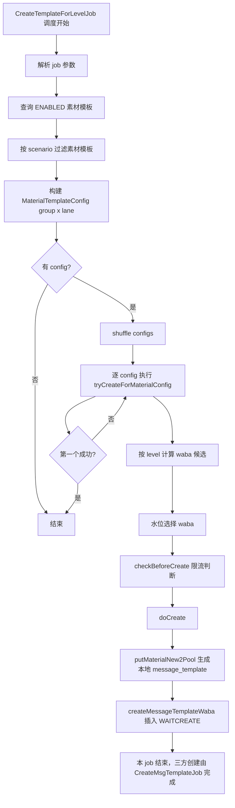
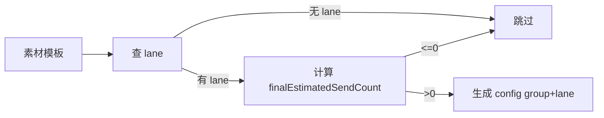
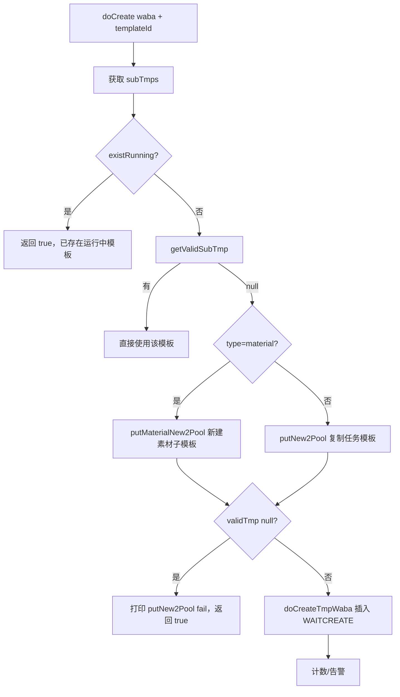

# CreateTemplateForLevelJob 模板创建 Job 逻辑梳理

> 文档日期：2026-09-09
> 说明：本文只梳理现状代码逻辑，不包含任何代码修改。当前分支代码以实际工作区为准。

## 1. 结论先行

1. `CreateTemplateForLevelJob` **不会直接调用三方通道创建模板**。
2. 它只做两件事：
   - 按策略选素材模板 + lane + level + waba；
   - 生成本地 `message_template` 和 `message_template_waba(status = WAITCREATE)`。
3. 真正调用 YCLOUD / NXCLOUD / GPI 创建模板的是另一个独立调度 **`CreateMsgTemplateJob`（createMsgTemplateJob）**，它消费 `WAITCREATE` 记录后调用 `opayManageService.createMessageTemplate(...)`。
4. 正常一次 job run 最多只会为**一个 config（素材模板 + lane）成功创建 1 条子模板**，随后结束本次调度。



## 2. 入口与参数

### 2.1 入口类

- Job 入口：`whatsapp-crm-job/.../CreateTemplateForLevelJob`
- 业务逻辑：`whatsapp-crm-data/.../xxljob/CreateTemplateForLevelJobService`
- 调度方法：`createTemplateForLevelJob(String param)`
- XxlJob 名称：`createTemplateForLevelJob`

### 2.2 参数格式

`CreateTemplateParam` 字段：

| 字段 | 默认值 | 说明 |
| --- | --- | --- |
| `scenario` | 无 | 场景 code，见下表 |
| `recentMinutes` | 无 | 最近 N 分钟内创建的 ENABLED 素材模板 |
| `taskWindowStartMinutes` | `-30` | UTILITY_FIRST 场景任务窗口开始（相对 task 开始时间） |
| `taskWindowEndMinutes` | `90` | UTILITY_FIRST 场景任务窗口结束 |
| `taskIds` | 无 | SPECIFIED_TASK 场景指定任务 ID |
| `materialTemplateNames` | 无 | SPECIFIED_MATERIAL_TEMPLATE_NAME 场景指定素材模板名 |

参数解析：以 `{` 开头按 JSON 解析，否则按纯数字解析为 `recentMinutes`。

示例：

```json
{
  "scenario": "specified_material_template_name",
  "materialTemplateNames": ["zlc_0909_02"]
}
```

### 2.3 ScenarioEnum

| code | 名称 | 说明 |
| --- | --- | --- |
| `default` | 默认 | 全部 ENABLED 素材模板 |
| `recent_minutes` | 最近分钟 | `recentMinutes > 0` 时按 ctime 过滤 |
| `utility_first` | 优先 UTILITY | 过滤最近有任务执行的组，且模板类型可能降级为 UTILITY |
| `specified_task` | 指定任务 | 按 `related_tasks` 关联任务过滤 |
| `specified_material_template_name` | 指定素材模板名 | 按素材模板 name 精确匹配 |
| `quantity_ratio_priority` | 数量比例优先 | 枚举中存在，但当前 Level Job 无额外专门分支 |

> 注意：`scenario` 缺省时，如果 `recentMinutes > 0` 走 `recent_minutes`，否则走 `default`；`quantity_ratio_priority` 当前未在 Level Job 里做显式处理。

## 3. 素材模板筛选逻辑

### 3.1 获取所有 ENABLED 模板

- 表：`message_material_group`
- 条件：`status = ENABLED`
- 若 `recentMinutes > 0` 追加：`ctime >= now - recentMinutes * 60s`

### 3.2 scenario 过滤

| scenario | 过滤规则 |
| --- | --- |
| `default` / `recent_minutes` | 不额外过滤 |
| `utility_first` | 取组 `related_tasks` 关联的 `task_sub` 最新 ctime，要求 `now` 落在 `[taskStartTime + taskWindowStartMinutes, taskStartTime + taskWindowEndMinutes]` |
| `specified_task` | 组 `related_tasks` 中存在任一指定 taskId |
| `specified_material_template_name` | 组名 `name` 精确等于传入的 `materialTemplateNames` |

## 4. 构建 MaterialTemplateConfig

`CreateTemplateJobService.buildMaterialTemplateConfigs`：

1. 对每个素材模板查询 `message_material_group_lane`；
2. 没有 lane 配置 → 跳过该组；
3. 有 `related_tasks` 时：
   - 取 task 最近一天发送量 `taskSubCountInfoService.getLastDayCnt`
   - 按 task 的 `laneCode` 归组
4. `finalEstimatedSendCount = max(lane.estimatedSendCount, task 最近一天量)`
5. `finalEstimatedSendCount <= 0` → 跳过该 lane；
6. 每个 group × lane 生成一个 config；
7. `levelList` 固定为 `["LARGE", "MEDIUM", "SMALL", "WARM"]`。



### 4.1 外层“只处理一个”逻辑

`CreateTemplateJobService.createTemplate`：

```java
Collections.shuffle(configs);
for (MaterialTemplateConfig config : configs) {
    if (creator.test(config)) {
        log.info("createTemplate success, materialGroupId: {}", config.getMaterialGroupId());
        return;
    }
}
```

- configs 会 shuffle；
- **只要有一个 config 返回 true，整个 job 立即结束**；
- 这是“只生成一条模板”的核心原因之一。

## 5. tryCreateForMaterialConfig：按 level 选择目标

1. 取 lane 级别百分比：

   ```java
   Map<String, Integer> levelPercent =
       businessConfig.getAutomaticStrategyLaneWabaCatePercent().get(laneCode);
   ```

2. levelList shuffle；
3. 对每个 level：
   - `percent = levelPercent.get(level)`，`percent <= 0` → 跳过；
   - 计算 `countHeight`：

     ```java
     int countHeight = (int) Math.ceil(
         (double) Math.toIntExact(estimatedSendCount * percent / 100) / 800);
     ```

     > 注意：`estimatedSendCount * percent / 100` 是整数运算，小数值会先截断为 0，如 `1 * 32 / 100 = 0`。

   - 计算 waba 候选：`levelWabaList ∩ laneAgentNameList`；
   - waba 列表为空 → 继续下一个 level；
   - `wabaNeedCreateTemplateCount = max(countHeight * 2 / wabaList.size(), 1)`；
   - 水位选择 waba（见第 6 节）；
   - `checkBeforeCreate(waba)` 通过 → `doCreate(...)` 并返回其结果；
   - `checkBeforeCreate` 被限流拦截 → 返回 true（本次视为已达上限）。

## 6. waba 分级与水位选择

### 6.1 level → waba 列表

`LevelWabaConfig.getAllLevelWabaListWithCache()`：

- 如果 `task.execute.waba.useScore = true`（Apollo key：`task.execute.waba.useScore`，默认 `true`）：
  - 取 BpScore（`messageSendStatsService.sourceAllScoreListWithCache`）；
  - 按 agentName 聚合最高分；
  - 分数阈值来自 `waba.level.score.config`：
    - `score >= LARGE` → LARGE
    - `LARGE > score >= MEDIUM` → MEDIUM
    - `MEDIUM > score >= SMALL` → SMALL
  - WARM waba 来自配置 `task.send.strategy.automatic.waba.category.mapping` 的 WARM 数组；
  - 缓存 5 分钟。
- 如果 `task.execute.waba.useScore = false`：
  - 直接用 `task.send.strategy.automatic.waba.category.mapping`。

lane 维度：

- `task.send.strategy.automatic.lane.waba`（JSON：lane → waba 列表）；
- `LaneWabaConfig.getLaneWabas()` 还叠加 `business_phone.support_chat_type` 为 MARKETING_CHAT / COLLECTION_CHAT 的 waba；
- 最终 level 候选 = `levelWabaList ∩ laneAgentNameList`。

### 6.2 getWabaHeight

- 取该素材模板已创建的 `message_template`（`message_material_template` 非 DELETED，且组合可发送）；
- 取该 waba 下的 `message_template_waba`；
- 按时间倒序后按 `status` 计算高度 `calcHeight(statuses, 3)`：
  - `REJECTED / CREATEFAIL`：连续失败 ≥ 3 次计 1 个失败分；
  - `APPROVED`：计 1 个成功分；
  - 高度 = 成功数 + 失败批次。

### 6.3 getWabaForWaterLevel

- 在所有候选 waba 中找高度最小的；
- 若 `minHeight >= waterLevel`（即 `wabaNeedCreateTemplateCount`）→ 放弃创建，返回 null；
- 否则在最小高度集合里随机选一个 waba。

## 7. checkBeforeCreate 限流/熔断判断

顺序如下，任一条件不满足返回 false：

| 顺序 | 判断 | Apollo Key | 默认值 | 说明 |
| --- | --- | --- | --- | --- |
| 1 | 今日创建总数 >= 上限 | `job.createTemplateForLaneJobV2.autoMaxCreateCntOneDay` | `400` | Redis 计数；已达上限且未告警 3 次时飞书告警 |
| 2 | 全局 RateLimiter | `job.createTemplateForLaneJobV2.autoTempRateLimit` | `0.01` | `RateLimiter.tryAcquire()` |
| 3 | 单 waba 并发创建数 >= 上限 | `job.createTemplateForLaneJobV2.autoTempWindow` | `5` | 统计该 waba `WAITCREATE` 或 `PENDING+agentTemplateId非空` |
| 4 | 全局并发创建数（all config + all material） >= 上限 | `job.createTemplateForLaneJobV2.allAutoTempWindow` | `10` | 含 ops 模板和素材模板 |
| 5 | 最近 N 分钟有 REJECTED | `job.createTemplateForLaneJobV2.rejectedPauseMinute` | `0` | `>0` 才检查；从 Redis ZSet 取最近拒绝记录 |

> 飞书告警只发一次后会写 Redis 标记；`getTodayCntKey()` 对应 Redis 常量见 `RedisKeyConstant`（今日创建模板计数 key）。

## 8. doCreate 流程



细节：

1. `subTmps = getMaterialCreatedTemplateList(materialGroupId, templateType)`：
   - `message_material_template` 非 DELETED → `message_template`；
   - 只保留 `material_combination_id` 属于可发送组合的模板；
   - UTILITY_FIRST 场景按 `template_type = UTILITY` 过滤。
2. `existRunning`：
   - 同 waba 下这些 subTmps 存在 `WAITCREATE` 或 `PENDING + agentTemplateId != ''` → true，不再新建。
3. `getValidSubTmp`：
   - 若 `job.createTemplateForLaneJobV2.alwaysUseNewTemplate = true` → 永远返回 null（总是新建）；
   - 否则返回该 waba 还没使用过的 subTmp。
4. `validTmp == null` 时：
   - 当前代码日志 `doCreate putNew2Pool fail` 后 **返回 true**（按现状保留，不做修改）。
5. `doCreateTmpWaba` → `createMessageTemplateWaba`：
   - 插入 `message_template_waba`
   - `status = WAITCREATE`
   - 记录 wabaId / agent / agentName / category 等。

## 9. putMaterialNew2Pool：素材模板生成本地子模板

1. 查询可创建组合：

   ```text
   message_material_combination
   WHERE material_group_id = ?
     AND status = ACTIVE
     AND material_status = NORMAL
   ```

2. 为空 → 返回 null（`canCreateMaterialCombination is empty`）。
3. shuffle 组合；
4. 查询该组、这些组合已有的 `message_template`：
   - 没有模板 → 随机选一个组合；
   - 有模板 → 优先选“该 waba 下还没用过”的组合；全用过则选使用次数最少的组合；
5. 加载组合对应的 HEADER / BODY / FOOTER / BUTTONS Mongo 素材；
6. `assembleTemplate`：
   - 模板名：`getCreateTemplateName(name + 场景前缀, 3)`，场景前缀：df/uf/st/smtn/rm/qrp；
   - `UTILITY_FIRST` 且组模板为 MARKETING → 改为 UTILITY；
   - 状态：`WAIT_ALL_SUBTEMPLATES_CREATE`；
   - components 由 HEADER/BODY/FOOTER/BUTTONS 素材元素组装（当前代码未在 Level Job 组装 LTO 组件，以现状为准）；
   - 保存 `message_template`；
   - 保存 `message_material_template` 关联（HEADER/BODY/FOOTER/BUTTONS）。
7. 再经 `createMessageTemplateWaba` 插入 `WAITCREATE` 记录。

## 10. 本 Job 与三方创建的关系

| Job | 数据动作 | 是否调三方 |
| --- | --- | --- |
| `CreateTemplateForLevelJob` | 生成 `message_template` + `message_template_waba(WAITCREATE)` | ❌ 否 |
| `CreateMsgTemplateJob`（独立调度） | 查 `WAITCREATE` → `RUNCREATE` → `opayManageService.createMessageTemplate(...)` | ✅ 是 |

三方创建后的状态流转：

```text
WAITCREATE -> RUNCREATE -> PENDING / APPROVED / REJECTED / CREATEFAIL / PAUSED / DISABLED
```

## 11. 涉及的 Apollo 配置 Key 汇总

| Apollo Key | 默认值 | 用途 |
| --- | --- | --- |
| `task.send.strategy.automatic.lane.waba.category.percent` | `{}` | lane → {LEVEL: percent}，例 `{"CUSTOMER_NEW":{"SMALL":33,"MEDIUM":35,"LARGE":32}}` |
| `task.send.strategy.automatic.waba.category.mapping` | `{}` | level → waba 列表（useScore=false 时直接使用，WARM 也来自这里） |
| `task.send.strategy.automatic.lane.waba` | 空 | lane → waba 列表 |
| `task.execute.waba.useScore` | `true` | 是否按 BpScore 计算 waba 等级 |
| `waba.level.score.config` | 空 | 等级分数阈值 JSON，如 `{"LARGE":100,"MEDIUM":60,"SMALL":30}` |
| `job.createTemplateForLaneJobV2.autoMaxCreateCntOneDay` | `400` | 每日自动创建模板上限 |
| `job.createTemplateForLaneJobV2.autoTempRateLimit` | `0.01` | 自动创建全局 RateLimiter 速率 |
| `job.createTemplateForLaneJobV2.autoTempWindow` | `5` | 单 waba 并发创建上限 |
| `job.createTemplateForLaneJobV2.allAutoTempWindow` | `10` | 全局并发创建上限 |
| `job.createTemplateForLaneJobV2.alwaysUseNewTemplate` | `true` | 是否总是新建模板而不是复用 |
| `job.createTemplateForLaneJobV2.rejectedPauseMinute` | `0` | 最近 N 分钟内出现 REJECTED 则暂停自动创建 |

> 说明：`BusinessConfig` 中还有 `job.createTemplateForLevelJob.autoTempConfigs`，但当前 `CreateTemplateForLevelJobService` 未使用该配置。

## 12. 常见现象对照

| 现象 | 原因 |
| --- | --- |
| 一次只生成 1 条模板 | `createTemplate` 第一个 success 就 return；`tryCreateForMaterialConfig` 第一个可用 level 就 return |
| 重跑后没有新建 | 该 waba 下已有 `WAITCREATE/PENDING` 记录，`existRunning` 返回 true |
| 某个 level 一直不创建 | 该 level 没有 waba（例如 LARGE=[]），或 `wabaNeedCreateTemplateCount` 水位已满 |
| `canCreateMaterialCombination is empty` | 该组没有 `ACTIVE + NORMAL` 组合 |
| 提高 estimatedSendCount 后仍一次只建一条 | 预估量只影响水位/选 waba，不改变 doCreate 一次只建一条 |
