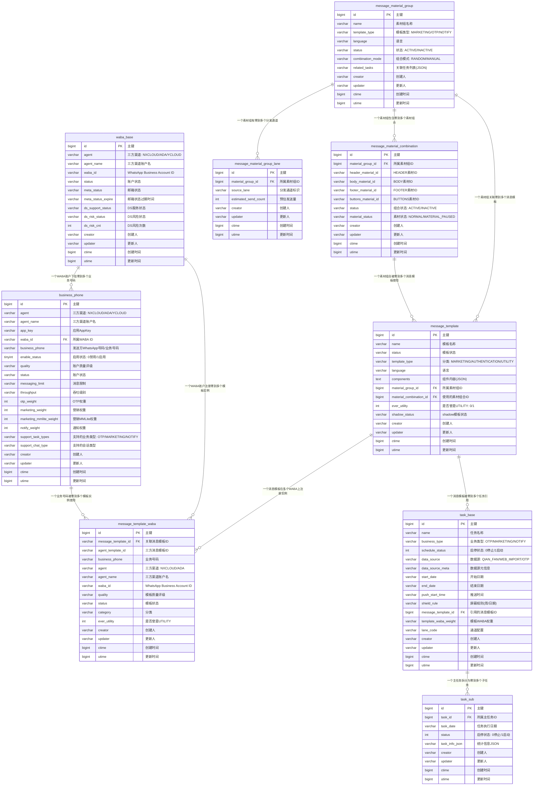

# 核心表 ER 图



## 关联关系详细说明

| 序号 | 源表 | 目标表 | 关系 | 描述 |
|------|------|--------|------|------|
| 1 | `message_material_group` | `message_material_combination` | 1 : N | **一个素材组包含零到多个素材组合**，每个组合是 HEADER/BODY/FOOTER/BUTTONS 的一种排列方式；多个组合供随机或手动挑选 |
| 2 | `message_material_group` | `message_material_group_lane` | 1 : N | **一个素材组有零到多个分发通道**，指定该素材组可下发给哪些数据源通道（lane），每条记录含预估发送量 |
| 3 | `message_material_group` | `message_template` | 1 : N | **一个素材组关联零到多个消息模板**，同一组素材可衍生出不同语言/版本/类型的消息模板 |
| 4 | `message_material_combination` | `message_template` | 1 : N | **一个素材组合被零到多个消息模板使用**，通过 `message_template.material_combination_id` 引用 |
| 5 | `message_template` | `message_template_waba` | 1 : N | **一个消息模板在多个 WABA 上注册实例**，一个模板需要在不同的 WhatsApp Business Account 上创建实例才能发送 |
| 6 | `message_template` | `task_base` | 1 : N | **一个消息模板被零到多个发送任务引用**，通过 `task_base.message_template_id` 关联 |
| 7 | `task_base` | `task_sub` | 1 : N | **一个主任务拆分为零到多个子任务**，按日期或批次拆分，每个子任务独立执行和统计 |
| 8 | `waba_base` | `business_phone` | 1 : N | **一个WABA账户包含零到多个业务号码**，同一 WABA 下挂多个发送号码，各自配置任务类型权重与启停状态 |
| 9 | `waba_base` | `message_template_waba` | 1 : N | **一个WABA账户注册零到多个消息模板实例**，模板在具体 WABA 上的注册与状态记录 |
| 10 | `business_phone` | `message_template_waba` | 1 : N | **一个业务号码被零到多个模板实例使用**，通过 `message_template_waba.business_phone`（业务号码）关联 |

## 数据流转概览

```
素材组 (message_material_group)
    ├── 1:N ──→ 素材组合 (message_material_combination)
    │                ↑ 定义各组件(HEADER/BODY/FOOTER/BUTTONS)的排列
    ├── 1:N ──→ 分发通道 (message_material_group_lane)
    │                ↑ 配置素材组允许下发的目标通道
    └── 1:N ──→ 消息模板 (message_template) ← 1:N ── (message_material_combination)
                     ↑ 组装成WABA识别的模板结构
                     └── 1:N ──→ WABA实例 (message_template_waba)
                                     ↑ 在三方平台(ADA/NXCLOUD)注册后的实例
                                     ↑ 1:N ──→ 由WABA账户 (waba_base) 承载
                                     ↑ 由业务号码 (business_phone) 提供发送号码
                                     └── 1:N ──→ 发送任务 (task_base)
                                                      ↑ 引用模板执行发送
                                                      └── 1:N ──→ 子任务 (task_sub)
                                                                   ↑ 按日期/批次拆分执行
```

```
WABA账户 (waba_base)
    ├── 1:N ──→ 业务号码 (business_phone)
    │                ↑ 账户下挂的发送号码，按任务类型配置权重
    │                └── 1:N ──→ WABA模板实例 (message_template_waba)
    │                               ↑ 模板在具体号码/WABA上的注册与状态
    └── 1:N ──→ WABA模板实例 (message_template_waba)
                     ↑ 同一 WABA 上注册多个模板实例
```

## 外键依赖汇总

| 外键字段 | 引用表 | 说明 |
|----------|--------|------|
| `message_material_combination.material_group_id` | `message_material_group.id` | 组合所属的素材组 |
| `message_material_group_lane.material_group_id` | `message_material_group.id` | 通道所属的素材组 |
| `message_template.material_group_id` | `message_material_group.id` | 模板关联的素材组 |
| `message_template.material_combination_id` | `message_material_combination.id` | 模板使用的具体素材组合 |
| `message_template_waba.message_template_id` | `message_template.id` | WABA实例所属的消息模板 |
| `task_base.message_template_id` | `message_template.id` | 任务引用的消息模板 |
| `task_sub.task_id` | `task_base.id` | 子任务所属的主任务 |
| `business_phone.waba_id` | `waba_base.waba_id` | 业务号码所属的WABA账户(按waba_id匹配) |
| `message_template_waba.waba_id` | `waba_base.waba_id` | 模板实例注册的WABA账户 |
| `message_template_waba.business_phone` | `business_phone.business_phone` | 模板实例使用的具体业务号码 |
